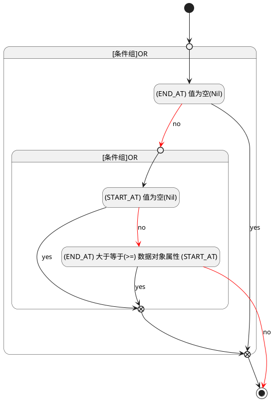

## 结束时间(END_AT) <!-- {docsify-ignore-all} -->

   

### 结束时间 :id=END_AT

#### 条件说明

##### (START_AT) 值为空(Nil) :id=a9b457c801a44ea36032d1c7807ded3c2

`START_AT(开始时间)` ISNULL 

##### (END_AT) 值为空(Nil) :id=aaa3824c33b48cf5d8eed4d7930bc518c

`END_AT(结束时间)` ISNULL 

##### (END_AT) 大于等于(>=) 数据对象属性 (START_AT) :id=a76baa63d44eee1d3630f7f19b52a9ac4

`END_AT(结束时间)` GTANDEQ  `START_AT`

> [!ATTENTION|label:规则信息|icon:fa fa-warning]
> 结束时间必须大于等于开始时间

