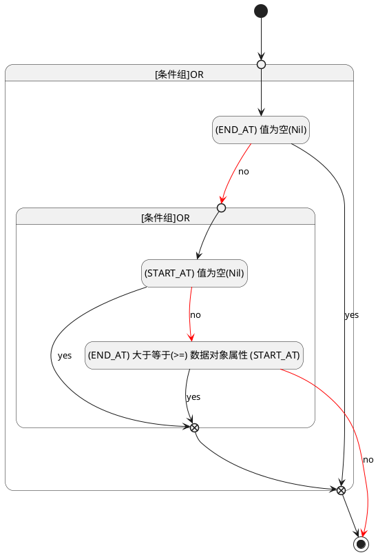

## 结束时间(END_AT) <!-- {docsify-ignore-all} -->

   

### 结束时间 :id=END_AT

#### 条件说明

##### (START_AT) 值为空(Nil) :id=abcf8276ad958cb14e15f0bf9ee564416

`START_AT(开始时间)` ISNULL 

##### (END_AT) 值为空(Nil) :id=a7f45efe71521accbc58deedbd47f78d3

`END_AT(结束时间)` ISNULL 

##### (END_AT) 大于等于(>=) 数据对象属性 (START_AT) :id=ac2bc5c731f671ac810da8a12f29518c1

`END_AT(结束时间)` GTANDEQ  `START_AT`

> [!ATTENTION|label:规则信息|icon:fa fa-warning]
> 结束时间必须大于等于开始时间

