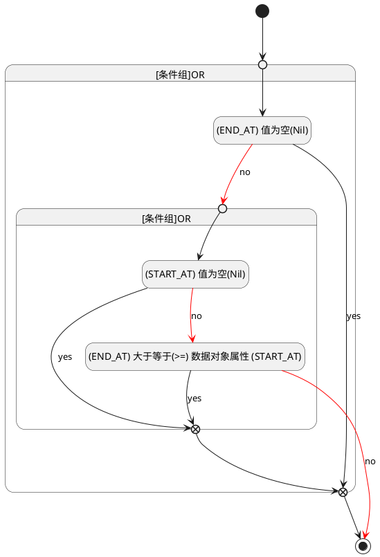

## 结束时间(END_AT) <!-- {docsify-ignore-all} -->

   

### 结束时间 :id=END_AT

```plantuml
@startuml
hide empty description
<style>
root {
  HyperlinkColor #42b983
}
</style>

state "start" as start  <<start>>
state "end" as end <<end>>
state "[条件组]OR" as fec9cb74f8e0fe7afd9b5bf25f4ea8ba [[$./end_at#afec9cb74f8e0fe7afd9b5bf25f4ea8ba {"[条件组]OR"}]] {
state " " as fec9cb74f8e0fe7afd9b5bf25f4ea8ba_entry  <<entryPoint>>
state "(END_AT) 值为空(Nil)" as 6bc45dc34472b7d65d9b158a4a85b6de [[$./end_at#a6bc45dc34472b7d65d9b158a4a85b6de {"[常规条件] 值为空(Nil)"}]]
state "[条件组]OR" as 21214ae6267b137fb0db49fa788ecd45 [[$./end_at#a21214ae6267b137fb0db49fa788ecd45 {"[条件组]OR"}]] {
state " " as 21214ae6267b137fb0db49fa788ecd45_entry  <<entryPoint>>
state "(START_AT) 值为空(Nil)" as 915fab40b51440d93b2dd9f5189902fc [[$./end_at#a915fab40b51440d93b2dd9f5189902fc {"[常规条件] 值为空(Nil)"}]]
state "(END_AT) 大于等于(>=) 数据对象属性 (START_AT)" as 6614cfedcdcfe7abfb7843e622a8512b [[$./end_at#a6614cfedcdcfe7abfb7843e622a8512b {"[常规条件] 大于等于(>=) 数据对象属性 (START_AT)"}]]
state " " as 21214ae6267b137fb0db49fa788ecd45_exit  <<exitPoint>>
}
state " " as fec9cb74f8e0fe7afd9b5bf25f4ea8ba_exit  <<exitPoint>>
}


start --> fec9cb74f8e0fe7afd9b5bf25f4ea8ba_entry 
fec9cb74f8e0fe7afd9b5bf25f4ea8ba_entry --> 6bc45dc34472b7d65d9b158a4a85b6de 
6bc45dc34472b7d65d9b158a4a85b6de --> fec9cb74f8e0fe7afd9b5bf25f4ea8ba_exit  : yes
6bc45dc34472b7d65d9b158a4a85b6de -[#red]-> 21214ae6267b137fb0db49fa788ecd45_entry  : no

21214ae6267b137fb0db49fa788ecd45_entry --> 915fab40b51440d93b2dd9f5189902fc 
915fab40b51440d93b2dd9f5189902fc --> 21214ae6267b137fb0db49fa788ecd45_exit  : yes
915fab40b51440d93b2dd9f5189902fc -[#red]-> 6614cfedcdcfe7abfb7843e622a8512b  : no

6614cfedcdcfe7abfb7843e622a8512b --> 21214ae6267b137fb0db49fa788ecd45_exit  : yes
6614cfedcdcfe7abfb7843e622a8512b -[#red]-> end  : no
21214ae6267b137fb0db49fa788ecd45_exit --> fec9cb74f8e0fe7afd9b5bf25f4ea8ba_exit 
fec9cb74f8e0fe7afd9b5bf25f4ea8ba_exit --> end 


@enduml
```

#### 条件说明

##### (END_AT) 值为空(Nil) :id=a6bc45dc34472b7d65d9b158a4a85b6de

`END_AT(结束时间)` ISNULL 

##### (END_AT) 大于等于(>=) 数据对象属性 (START_AT) :id=a6614cfedcdcfe7abfb7843e622a8512b

`END_AT(结束时间)` GTANDEQ  `START_AT`

> [!ATTENTION|label:规则信息|icon:fa fa-warning]
> 结束时间必须大于等于开始时间

##### (START_AT) 值为空(Nil) :id=a915fab40b51440d93b2dd9f5189902fc

`START_AT(开始时间)` ISNULL 

