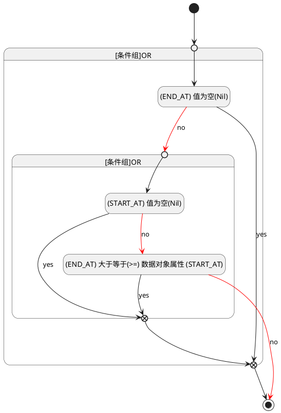

## 结束时间(END_AT) <!-- {docsify-ignore-all} -->

   

### 结束时间 :id=END_AT

```plantuml
@startuml
hide empty description
<style>
root {
  HyperlinkColor #42b983
}
</style>

state "start" as start  <<start>>
state "end" as end <<end>>
state "[条件组]OR" as 1ddd21defd7757b20bbcaf7f75ba6287 [[$./end_at#a1ddd21defd7757b20bbcaf7f75ba6287 {"[条件组]OR"}]] {
state " " as 1ddd21defd7757b20bbcaf7f75ba6287_entry  <<entryPoint>>
state "(END_AT) 值为空(Nil)" as 37c5419d068c7c921c1040c19557b899 [[$./end_at#a37c5419d068c7c921c1040c19557b899 {"[常规条件] 值为空(Nil)"}]]
state "[条件组]OR" as d063693828956a8f7922e029c665326d [[$./end_at#ad063693828956a8f7922e029c665326d {"[条件组]OR"}]] {
state " " as d063693828956a8f7922e029c665326d_entry  <<entryPoint>>
state "(START_AT) 值为空(Nil)" as 5dcf76d8667050c5d82602f5c3bc33bf [[$./end_at#a5dcf76d8667050c5d82602f5c3bc33bf {"[常规条件] 值为空(Nil)"}]]
state "(END_AT) 大于等于(>=) 数据对象属性 (START_AT)" as 6ec0ca3551ecb69ebd354f64dc0ca4b5 [[$./end_at#a6ec0ca3551ecb69ebd354f64dc0ca4b5 {"[常规条件] 大于等于(>=) 数据对象属性 (START_AT)"}]]
state " " as d063693828956a8f7922e029c665326d_exit  <<exitPoint>>
}
state " " as 1ddd21defd7757b20bbcaf7f75ba6287_exit  <<exitPoint>>
}


start --> 1ddd21defd7757b20bbcaf7f75ba6287_entry 
1ddd21defd7757b20bbcaf7f75ba6287_entry --> 37c5419d068c7c921c1040c19557b899 
37c5419d068c7c921c1040c19557b899 --> 1ddd21defd7757b20bbcaf7f75ba6287_exit  : yes
37c5419d068c7c921c1040c19557b899 -[#red]-> d063693828956a8f7922e029c665326d_entry  : no

d063693828956a8f7922e029c665326d_entry --> 5dcf76d8667050c5d82602f5c3bc33bf 
5dcf76d8667050c5d82602f5c3bc33bf --> d063693828956a8f7922e029c665326d_exit  : yes
5dcf76d8667050c5d82602f5c3bc33bf -[#red]-> 6ec0ca3551ecb69ebd354f64dc0ca4b5  : no

6ec0ca3551ecb69ebd354f64dc0ca4b5 --> d063693828956a8f7922e029c665326d_exit  : yes
6ec0ca3551ecb69ebd354f64dc0ca4b5 -[#red]-> end  : no
d063693828956a8f7922e029c665326d_exit --> 1ddd21defd7757b20bbcaf7f75ba6287_exit 
1ddd21defd7757b20bbcaf7f75ba6287_exit --> end 


@enduml
```

#### 条件说明

##### (END_AT) 值为空(Nil) :id=a37c5419d068c7c921c1040c19557b899

`END_AT(结束时间)` ISNULL 

##### (START_AT) 值为空(Nil) :id=a5dcf76d8667050c5d82602f5c3bc33bf

`START_AT(开始时间)` ISNULL 

##### (END_AT) 大于等于(>=) 数据对象属性 (START_AT) :id=a6ec0ca3551ecb69ebd354f64dc0ca4b5

`END_AT(结束时间)` GTANDEQ  `START_AT`

> [!ATTENTION|label:规则信息|icon:fa fa-warning]
> 结束时间必须大于等于开始时间

