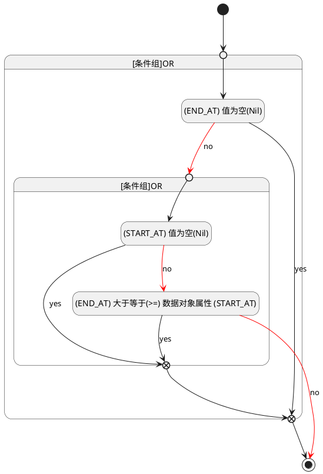

## 结束时间(END_AT) <!-- {docsify-ignore-all} -->

   

### 结束时间 :id=END_AT

```plantuml
@startuml
hide empty description
<style>
root {
  HyperlinkColor #42b983
}
</style>

state "start" as start  <<start>>
state "end" as end <<end>>
state "[条件组]OR" as 97c2eff3658e37ec746710a59cec4ebc [[$./end_at#a97c2eff3658e37ec746710a59cec4ebc {"[条件组]OR"}]] {
state " " as 97c2eff3658e37ec746710a59cec4ebc_entry  <<entryPoint>>
state "(END_AT) 值为空(Nil)" as 79c936045d9afc441d3b5576ea8b7a7f [[$./end_at#a79c936045d9afc441d3b5576ea8b7a7f {"[常规条件] 值为空(Nil)"}]]
state "[条件组]OR" as c396715449743cbb855f59d060348f67 [[$./end_at#ac396715449743cbb855f59d060348f67 {"[条件组]OR"}]] {
state " " as c396715449743cbb855f59d060348f67_entry  <<entryPoint>>
state "(START_AT) 值为空(Nil)" as b256aea0c42a226d73b69529b59e40fd [[$./end_at#ab256aea0c42a226d73b69529b59e40fd {"[常规条件] 值为空(Nil)"}]]
state "(END_AT) 大于等于(>=) 数据对象属性 (START_AT)" as 71db39ebf169d27a6042bdf7240a759f [[$./end_at#a71db39ebf169d27a6042bdf7240a759f {"[常规条件] 大于等于(>=) 数据对象属性 (START_AT)"}]]
state " " as c396715449743cbb855f59d060348f67_exit  <<exitPoint>>
}
state " " as 97c2eff3658e37ec746710a59cec4ebc_exit  <<exitPoint>>
}


start --> 97c2eff3658e37ec746710a59cec4ebc_entry 
97c2eff3658e37ec746710a59cec4ebc_entry --> 79c936045d9afc441d3b5576ea8b7a7f 
79c936045d9afc441d3b5576ea8b7a7f --> 97c2eff3658e37ec746710a59cec4ebc_exit  : yes
79c936045d9afc441d3b5576ea8b7a7f -[#red]-> c396715449743cbb855f59d060348f67_entry  : no

c396715449743cbb855f59d060348f67_entry --> b256aea0c42a226d73b69529b59e40fd 
b256aea0c42a226d73b69529b59e40fd --> c396715449743cbb855f59d060348f67_exit  : yes
b256aea0c42a226d73b69529b59e40fd -[#red]-> 71db39ebf169d27a6042bdf7240a759f  : no

71db39ebf169d27a6042bdf7240a759f --> c396715449743cbb855f59d060348f67_exit  : yes
71db39ebf169d27a6042bdf7240a759f -[#red]-> end  : no
c396715449743cbb855f59d060348f67_exit --> 97c2eff3658e37ec746710a59cec4ebc_exit 
97c2eff3658e37ec746710a59cec4ebc_exit --> end 


@enduml
```

#### 条件说明

##### (START_AT) 值为空(Nil) :id=ab256aea0c42a226d73b69529b59e40fd

`START_AT(开始时间)` ISNULL 

##### (END_AT) 值为空(Nil) :id=a79c936045d9afc441d3b5576ea8b7a7f

`END_AT(结束时间)` ISNULL 

##### (END_AT) 大于等于(>=) 数据对象属性 (START_AT) :id=a71db39ebf169d27a6042bdf7240a759f

`END_AT(结束时间)` GTANDEQ  `START_AT`

> [!ATTENTION|label:规则信息|icon:fa fa-warning]
> 结束时间必须大于等于开始时间

