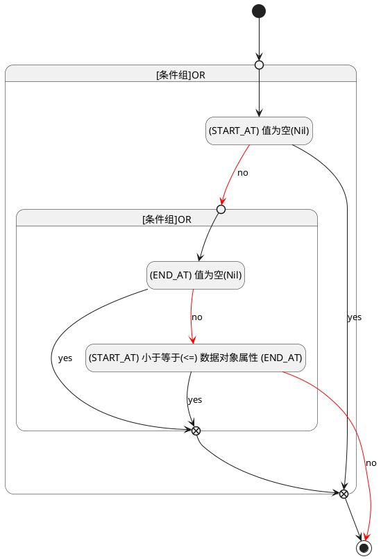

## 开始时间(START_AT) <!-- {docsify-ignore-all} -->

   

### 开始时间 :id=START_AT

#### 条件说明

##### (START_AT) 小于等于(<=) 数据对象属性 (END_AT) :id=aa9be785fa96ee55a6c19e2065c6551a0

`START_AT(开始时间)` LTANDEQ  `END_AT`

> [!ATTENTION|label:规则信息|icon:fa fa-warning]
> 开始时间必须小于等于结束时间

##### (START_AT) 值为空(Nil) :id=a8c4751e2aa1a7328de2983f977c490d3

`START_AT(开始时间)` ISNULL 

##### (END_AT) 值为空(Nil) :id=a0e7d809a4761730b14c21f7e68d4aa81

`END_AT(结束时间)` ISNULL 

