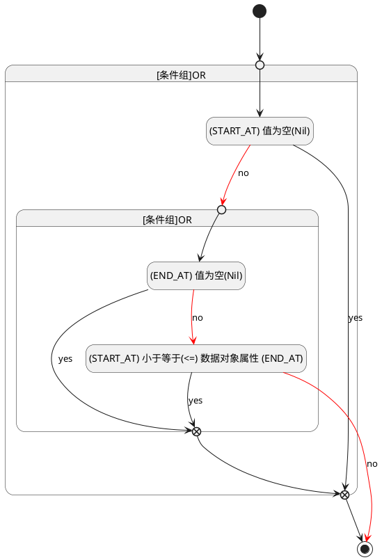

## 开始时间(START_AT) <!-- {docsify-ignore-all} -->

   

### 开始时间 :id=START_AT

```plantuml
@startuml
hide empty description
<style>
root {
  HyperlinkColor #42b983
}
</style>

state "start" as start  <<start>>
state "end" as end <<end>>
state "[条件组]OR" as 73533bc0eaffd408f4fe0148565bee47 [[$./start_at#a73533bc0eaffd408f4fe0148565bee47 {"[条件组]OR"}]] {
state " " as 73533bc0eaffd408f4fe0148565bee47_entry  <<entryPoint>>
state "(START_AT) 值为空(Nil)" as 60abbb933dbb2b7380e54654f81ca943 [[$./start_at#a60abbb933dbb2b7380e54654f81ca943 {"[常规条件] 值为空(Nil)"}]]
state "[条件组]OR" as 1348a14fe15f9e1c0deee0ed77c6772f [[$./start_at#a1348a14fe15f9e1c0deee0ed77c6772f {"[条件组]OR"}]] {
state " " as 1348a14fe15f9e1c0deee0ed77c6772f_entry  <<entryPoint>>
state "(END_AT) 值为空(Nil)" as e26e21dcb8c2e0ba8a5b71365830e26e [[$./start_at#ae26e21dcb8c2e0ba8a5b71365830e26e {"[常规条件] 值为空(Nil)"}]]
state "(START_AT) 小于等于(<=) 数据对象属性 (END_AT)" as 4b9a0b4cccb884f502087d7cb0e75c04 [[$./start_at#a4b9a0b4cccb884f502087d7cb0e75c04 {"[常规条件] 小于等于(<=) 数据对象属性 (END_AT)"}]]
state " " as 1348a14fe15f9e1c0deee0ed77c6772f_exit  <<exitPoint>>
}
state " " as 73533bc0eaffd408f4fe0148565bee47_exit  <<exitPoint>>
}


start --> 73533bc0eaffd408f4fe0148565bee47_entry 
73533bc0eaffd408f4fe0148565bee47_entry --> 60abbb933dbb2b7380e54654f81ca943 
60abbb933dbb2b7380e54654f81ca943 --> 73533bc0eaffd408f4fe0148565bee47_exit  : yes
60abbb933dbb2b7380e54654f81ca943 -[#red]-> 1348a14fe15f9e1c0deee0ed77c6772f_entry  : no

1348a14fe15f9e1c0deee0ed77c6772f_entry --> e26e21dcb8c2e0ba8a5b71365830e26e 
e26e21dcb8c2e0ba8a5b71365830e26e --> 1348a14fe15f9e1c0deee0ed77c6772f_exit  : yes
e26e21dcb8c2e0ba8a5b71365830e26e -[#red]-> 4b9a0b4cccb884f502087d7cb0e75c04  : no

4b9a0b4cccb884f502087d7cb0e75c04 --> 1348a14fe15f9e1c0deee0ed77c6772f_exit  : yes
4b9a0b4cccb884f502087d7cb0e75c04 -[#red]-> end  : no
1348a14fe15f9e1c0deee0ed77c6772f_exit --> 73533bc0eaffd408f4fe0148565bee47_exit 
73533bc0eaffd408f4fe0148565bee47_exit --> end 


@enduml
```

#### 条件说明

##### (END_AT) 值为空(Nil) :id=ae26e21dcb8c2e0ba8a5b71365830e26e

`END_AT(结束时间)` ISNULL 

##### (START_AT) 小于等于(<=) 数据对象属性 (END_AT) :id=a4b9a0b4cccb884f502087d7cb0e75c04

`START_AT(开始时间)` LTANDEQ  `END_AT`

> [!ATTENTION|label:规则信息|icon:fa fa-warning]
> 开始时间必须小于等于结束时间

##### (START_AT) 值为空(Nil) :id=a60abbb933dbb2b7380e54654f81ca943

`START_AT(开始时间)` ISNULL 

