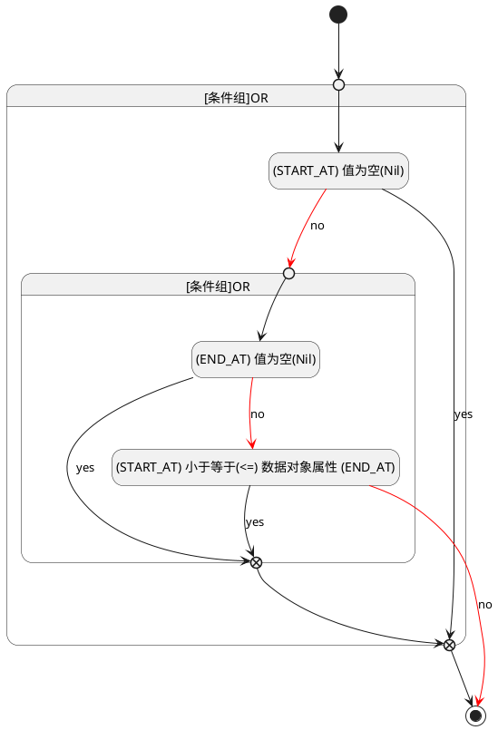

## 开始时间(START_AT) <!-- {docsify-ignore-all} -->

   

### 开始时间 :id=START_AT

```plantuml
@startuml
hide empty description
<style>
root {
  HyperlinkColor #42b983
}
</style>

state "start" as start  <<start>>
state "end" as end <<end>>
state "[条件组]OR" as 8cb12fce37bf3fe3e51fb7ff48e426c0 [[$./start_at#a8cb12fce37bf3fe3e51fb7ff48e426c0 {"[条件组]OR"}]] {
state " " as 8cb12fce37bf3fe3e51fb7ff48e426c0_entry  <<entryPoint>>
state "(START_AT) 值为空(Nil)" as f83d1ee9b089111bbd55048b923f9137 [[$./start_at#af83d1ee9b089111bbd55048b923f9137 {"[常规条件] 值为空(Nil)"}]]
state "[条件组]OR" as 736fec9e841e2626f97e77054b191c13 [[$./start_at#a736fec9e841e2626f97e77054b191c13 {"[条件组]OR"}]] {
state " " as 736fec9e841e2626f97e77054b191c13_entry  <<entryPoint>>
state "(END_AT) 值为空(Nil)" as b115137f7d30d80d49e1f4a090af26b6 [[$./start_at#ab115137f7d30d80d49e1f4a090af26b6 {"[常规条件] 值为空(Nil)"}]]
state "(START_AT) 小于等于(<=) 数据对象属性 (END_AT)" as 71629b118744af31025e9673ac923968 [[$./start_at#a71629b118744af31025e9673ac923968 {"[常规条件] 小于等于(<=) 数据对象属性 (END_AT)"}]]
state " " as 736fec9e841e2626f97e77054b191c13_exit  <<exitPoint>>
}
state " " as 8cb12fce37bf3fe3e51fb7ff48e426c0_exit  <<exitPoint>>
}


start --> 8cb12fce37bf3fe3e51fb7ff48e426c0_entry 
8cb12fce37bf3fe3e51fb7ff48e426c0_entry --> f83d1ee9b089111bbd55048b923f9137 
f83d1ee9b089111bbd55048b923f9137 --> 8cb12fce37bf3fe3e51fb7ff48e426c0_exit  : yes
f83d1ee9b089111bbd55048b923f9137 -[#red]-> 736fec9e841e2626f97e77054b191c13_entry  : no

736fec9e841e2626f97e77054b191c13_entry --> b115137f7d30d80d49e1f4a090af26b6 
b115137f7d30d80d49e1f4a090af26b6 --> 736fec9e841e2626f97e77054b191c13_exit  : yes
b115137f7d30d80d49e1f4a090af26b6 -[#red]-> 71629b118744af31025e9673ac923968  : no

71629b118744af31025e9673ac923968 --> 736fec9e841e2626f97e77054b191c13_exit  : yes
71629b118744af31025e9673ac923968 -[#red]-> end  : no
736fec9e841e2626f97e77054b191c13_exit --> 8cb12fce37bf3fe3e51fb7ff48e426c0_exit 
8cb12fce37bf3fe3e51fb7ff48e426c0_exit --> end 


@enduml
```

#### 条件说明

##### (END_AT) 值为空(Nil) :id=ab115137f7d30d80d49e1f4a090af26b6

`END_AT(结束时间)` ISNULL 

##### (START_AT) 小于等于(<=) 数据对象属性 (END_AT) :id=a71629b118744af31025e9673ac923968

`START_AT(开始时间)` LTANDEQ  `END_AT`

> [!ATTENTION|label:规则信息|icon:fa fa-warning]
> 开始时间必须小于等于结束时间

##### (START_AT) 值为空(Nil) :id=af83d1ee9b089111bbd55048b923f9137

`START_AT(开始时间)` ISNULL 

