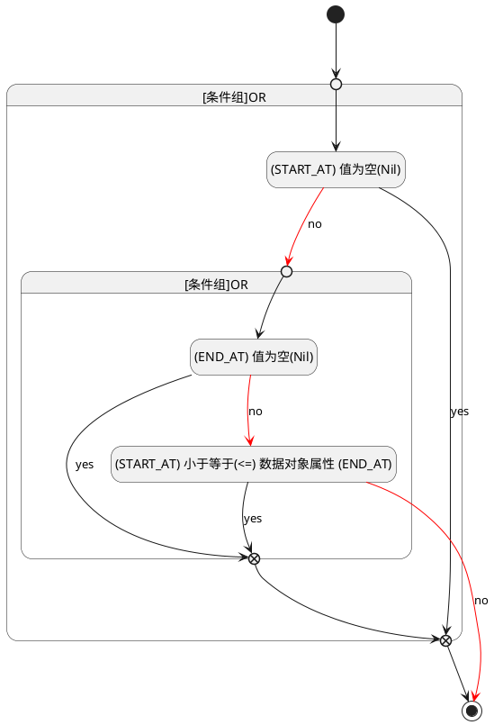

## 开始时间(START_AT) <!-- {docsify-ignore-all} -->

   

### 开始时间 :id=START_AT

```plantuml
@startuml
hide empty description
<style>
root {
  HyperlinkColor #42b983
}
</style>

state "start" as start  <<start>>
state "end" as end <<end>>
state "[条件组]OR" as 9e972fba859aa03417755aaa71cefe5d [[$./start_at#a9e972fba859aa03417755aaa71cefe5d {"[条件组]OR"}]] {
state " " as 9e972fba859aa03417755aaa71cefe5d_entry  <<entryPoint>>
state "(START_AT) 值为空(Nil)" as d8cf0c7f2b845d3099298571d38dc624 [[$./start_at#ad8cf0c7f2b845d3099298571d38dc624 {"[常规条件] 值为空(Nil)"}]]
state "[条件组]OR" as 0a53b1c2ff8f21140baf0a8196738097 [[$./start_at#a0a53b1c2ff8f21140baf0a8196738097 {"[条件组]OR"}]] {
state " " as 0a53b1c2ff8f21140baf0a8196738097_entry  <<entryPoint>>
state "(END_AT) 值为空(Nil)" as f4aaf552d98bc12a66af1affa0fa9546 [[$./start_at#af4aaf552d98bc12a66af1affa0fa9546 {"[常规条件] 值为空(Nil)"}]]
state "(START_AT) 小于等于(<=) 数据对象属性 (END_AT)" as 2a571c77a0746075697ce4c85e9bcea6 [[$./start_at#a2a571c77a0746075697ce4c85e9bcea6 {"[常规条件] 小于等于(<=) 数据对象属性 (END_AT)"}]]
state " " as 0a53b1c2ff8f21140baf0a8196738097_exit  <<exitPoint>>
}
state " " as 9e972fba859aa03417755aaa71cefe5d_exit  <<exitPoint>>
}


start --> 9e972fba859aa03417755aaa71cefe5d_entry 
9e972fba859aa03417755aaa71cefe5d_entry --> d8cf0c7f2b845d3099298571d38dc624 
d8cf0c7f2b845d3099298571d38dc624 --> 9e972fba859aa03417755aaa71cefe5d_exit  : yes
d8cf0c7f2b845d3099298571d38dc624 -[#red]-> 0a53b1c2ff8f21140baf0a8196738097_entry  : no

0a53b1c2ff8f21140baf0a8196738097_entry --> f4aaf552d98bc12a66af1affa0fa9546 
f4aaf552d98bc12a66af1affa0fa9546 --> 0a53b1c2ff8f21140baf0a8196738097_exit  : yes
f4aaf552d98bc12a66af1affa0fa9546 -[#red]-> 2a571c77a0746075697ce4c85e9bcea6  : no

2a571c77a0746075697ce4c85e9bcea6 --> 0a53b1c2ff8f21140baf0a8196738097_exit  : yes
2a571c77a0746075697ce4c85e9bcea6 -[#red]-> end  : no
0a53b1c2ff8f21140baf0a8196738097_exit --> 9e972fba859aa03417755aaa71cefe5d_exit 
9e972fba859aa03417755aaa71cefe5d_exit --> end 


@enduml
```

#### 条件说明

##### (START_AT) 小于等于(<=) 数据对象属性 (END_AT) :id=a2a571c77a0746075697ce4c85e9bcea6

`START_AT(开始时间)` LTANDEQ  `END_AT`

> [!ATTENTION|label:规则信息|icon:fa fa-warning]
> 开始时间必须小于等于结束时间

##### (END_AT) 值为空(Nil) :id=af4aaf552d98bc12a66af1affa0fa9546

`END_AT(结束时间)` ISNULL 

##### (START_AT) 值为空(Nil) :id=ad8cf0c7f2b845d3099298571d38dc624

`START_AT(开始时间)` ISNULL 

