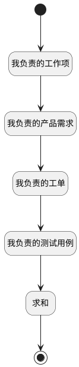

## 我负责的事项 <!-- {docsify-ignore-all} -->

   查询我负责的事项，工作台的计数器使用

### 处理过程




### 处理步骤说明

#### 开始 :id=Begin<sup class="footnote-symbol"> <font color=gray size=1>[开始]</font></sup>


*- N/A*
#### 结束 :id=END1<sup class="footnote-symbol"> <font color=gray size=1>[结束]</font></sup>


返回 `Default(传入变量)`

#### 我负责的工作项 :id=RAWSQLCALL1<sup class="footnote-symbol"> <font color=gray size=1>[直接SQL调用]</font></sup>


<p class="panel-title"><b>执行sql语句</b></p>

```sql
SELECT count(t.id) as my_charge_work_item FROM work_item t where t.IS_DELETED = 0 AND t.IS_ARCHIVED = 0 AND t.ASSIGNEE_ID = ?
```

<p class="panel-title"><b>执行sql参数</b></p>

1. `用户全局对象.srfpersonid`

重置参数`Default(传入变量)`，并将执行sql结果赋值给参数`Default(传入变量)`

#### 我负责的产品需求 :id=RAWSQLCALL2<sup class="footnote-symbol"> <font color=gray size=1>[直接SQL调用]</font></sup>


<p class="panel-title"><b>执行sql语句</b></p>

```sql
-- 我负责的产品需求
SELECT count(t.id) as my_charge_idea FROM idea t where t.IS_DELETED = 0 AND t.IS_ARCHIVED = 0 AND t.ASSIGNEE_ID = ?
```

<p class="panel-title"><b>执行sql参数</b></p>

1. `用户全局对象.srfpersonid`

重置参数`Default(传入变量)`，并将执行sql结果赋值给参数`Default(传入变量)`

#### 我负责的工单 :id=RAWSQLCALL3<sup class="footnote-symbol"> <font color=gray size=1>[直接SQL调用]</font></sup>


<p class="panel-title"><b>执行sql语句</b></p>

```sql
-- 我负责的工单
SELECT count(t.id) as my_charge_ticket FROM ticket t where t.IS_DELETED = 0 AND t.IS_ARCHIVED = 0 AND t.ASSIGNEE_ID = ?
```

<p class="panel-title"><b>执行sql参数</b></p>

1. `用户全局对象.srfpersonid`

重置参数`Default(传入变量)`，并将执行sql结果赋值给参数`Default(传入变量)`

#### 我负责的测试用例 :id=RAWSQLCALL4<sup class="footnote-symbol"> <font color=gray size=1>[直接SQL调用]</font></sup>


<p class="panel-title"><b>执行sql语句</b></p>

```sql
-- 我负责的测试用例
SELECT count(t.id) as my_charge_test_case FROM test_case t where t.IS_DELETED = 0 AND t.IS_ARCHIVED = 0 AND t.MAINTENANCE_ID = ?
```

<p class="panel-title"><b>执行sql参数</b></p>

1. `用户全局对象.srfpersonid`

重置参数`Default(传入变量)`，并将执行sql结果赋值给参数`Default(传入变量)`

#### 求和 :id=RAWSQLCALL5<sup class="footnote-symbol"> <font color=gray size=1>[直接SQL调用]</font></sup>


<p class="panel-title"><b>执行sql语句</b></p>

```sql
SELECT (
    (SELECT count(id) FROM work_item WHERE IS_DELETED = 0 AND IS_ARCHIVED = 0 AND ASSIGNEE_ID = ?) +
    (SELECT count(id) FROM idea WHERE IS_DELETED = 0 AND IS_ARCHIVED = 0 AND ASSIGNEE_ID = ?) +
    (SELECT count(id) FROM ticket WHERE IS_DELETED = 0 AND IS_ARCHIVED = 0 AND ASSIGNEE_ID = ?) +
    (SELECT count(id) FROM test_case WHERE IS_DELETED = 0 AND IS_ARCHIVED = 0 AND MAINTENANCE_ID = ?)
) AS my_charge_total
```

<p class="panel-title"><b>执行sql参数</b></p>

1. `用户全局对象.srfpersonid`
2. `用户全局对象.srfpersonid`
3. `用户全局对象.srfpersonid`
4. `用户全局对象.srfpersonid`

重置参数`Default(传入变量)`，并将执行sql结果赋值给参数`Default(传入变量)`


### 实体逻辑参数

|    中文名   |    代码名    |  数据类型    |  实体   |备注 |
| --------| --------| -------- | -------- | --------   |
|传入变量(<i class="fa fa-check"/></i>)|Default|数据对象|[最近访问(RECENT)](module/Base/recent.md)||
|filter|filter|过滤器|||
|我负责的事项|my_assignee|分页查询|||
|temp_obj|temp_obj|数据对象|||
