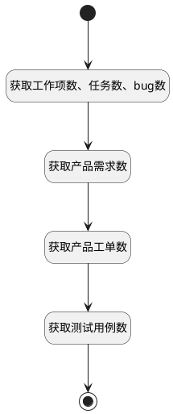

## 我的任务总结 <!-- {docsify-ignore-all} -->

   获取我的任务总结数据

### 处理过程




### 处理步骤说明

#### 开始 :id=Begin<sup class="footnote-symbol"> <font color=gray size=1>[开始]</font></sup>


*- N/A*
#### 结束 :id=END1<sup class="footnote-symbol"> <font color=gray size=1>[结束]</font></sup>


返回 `result`

#### 获取工作项数、任务数、bug数 :id=RAWSQLCALL1<sup class="footnote-symbol"> <font color=gray size=1>[直接SQL调用]</font></sup>


<p class="panel-title"><b>执行sql语句</b></p>

```sql
select sum(if(t4.`GROUP` <> 'task' and t4.`GROUP` <> 'bug', 1, 0)) other_item_num,
       sum(if(t4.`GROUP` = 'task', 1, 0))                          task_num,
       sum(if(t4.`GROUP` = 'bug', 1, 0))                           bug_num
from work_item t1
         inner join work_item_state t2 on t1.STATE = t2.ID and t2.TYPE = 'in_progress'
         inner join project t3 on t1.PROJECT_ID = t3.ID and t3.IS_DELETED = 0 and t3.IS_ARCHIVED = 0
         inner join work_item_type t4 on t4.ID = t1.WORK_ITEM_TYPE_ID
where (t1.IS_ARCHIVED = 0
    and t1.IS_DELETED = 0)
  and (t1.ASSIGNEE_ID = ?
    or exists (select 1
               from executor t5
               where t1.id = t5.owner_id
                 and t5.owner_type = 'WORK_ITEM'
                 and t5.owner_subtype = 'WORK_ITEM'
                 and t5.user_id = ?))
```

<p class="panel-title"><b>执行sql参数</b></p>

1. `用户全局对象.srfpersonid`
2. `用户全局对象.srfpersonid`

重置参数`result(result)`，并将执行sql结果赋值给参数`result(result)`

#### 获取产品需求数 :id=RAWSQLCALL2<sup class="footnote-symbol"> <font color=gray size=1>[直接SQL调用]</font></sup>


<p class="panel-title"><b>执行sql语句</b></p>

```sql
select count(1) idea_num
from idea t1
         inner join dictionary t2 on t1.STATE = t2.VAL and t2.CATALOG = 'idea_state' and t2.type = 'in_progress'
         inner join product t3 on t1.PRODUCT_ID = t3.ID and t3.IS_ARCHIVED = 0 and t3.IS_DELETED = 0
where t1.ASSIGNEE_ID = ?
  and t1.IS_DELETED = 0
  and t1.IS_ARCHIVED = 0
```

<p class="panel-title"><b>执行sql参数</b></p>

1. `用户全局对象.srfpersonid`

重置参数`result(result)`，并将执行sql结果赋值给参数`result(result)`

#### 获取产品工单数 :id=RAWSQLCALL4<sup class="footnote-symbol"> <font color=gray size=1>[直接SQL调用]</font></sup>


<p class="panel-title"><b>执行sql语句</b></p>

```sql
select count(1) ticket_num
from ticket t1
         inner join dictionary t2 on t1.STATE = t2.VAL and t2.CATALOG = 'ticket_state' and t2.type = 'in_progress'
         inner join product t3 on t1.PRODUCT_ID = t3.ID and t3.IS_ARCHIVED = 0 and t3.IS_DELETED = 0
where t1.ASSIGNEE_ID = ?
  and t1.IS_ARCHIVED = 0
  and t1.IS_DELETED = 0
```

<p class="panel-title"><b>执行sql参数</b></p>

1. `用户全局对象.srfpersonid`

重置参数`result(result)`，并将执行sql结果赋值给参数`result(result)`

#### 获取测试用例数 :id=RAWSQLCALL3<sup class="footnote-symbol"> <font color=gray size=1>[直接SQL调用]</font></sup>


<p class="panel-title"><b>执行sql语句</b></p>

```sql
select count(1) case_num
from test_case t1
         inner join library t2 on t1.TEST_LIBRARY_ID = t2.ID and t2.IS_DELETED = 0 and t2.IS_ARCHIVED = 0
where t1.MAINTENANCE_ID = ?
  and t1.IS_DELETED = 0
  and t1.IS_ARCHIVED = 0
  and t1.STATE = '10'
```

<p class="panel-title"><b>执行sql参数</b></p>

1. `用户全局对象.srfpersonid`

重置参数`result(result)`，并将执行sql结果赋值给参数`result(result)`


### 实体逻辑参数

|    中文名   |    代码名    |  数据类型    |  实体   |备注 |
| --------| --------| -------- | -------- | --------   |
|传入变量(<i class="fa fa-check"/></i>)|Default|数据对象|[最近访问(RECENT)](module/Base/recent.md)||
|result|result|数据对象|||
