## 定时清理最近访问数据 <!-- {docsify-ignore-all} -->

   每天定时清理最近访问数据，每人每个访问类型数据只保留100条

### 处理过程

```plantuml
@startuml
hide empty description
<style>
root {
  HyperlinkColor #42b983
}
</style>

hide empty description
state "开始" as Begin <<start>> [[$./recent_clean#begin {"开始"}]]
state "定时清理最近访问数据" as RAWSQLCALL1  [[$./recent_clean#rawsqlcall1 {"定时清理最近访问数据"}]]
state "结束" as END1 <<end>> [[$./recent_clean#end1 {"结束"}]]


Begin --> RAWSQLCALL1
RAWSQLCALL1 --> END1


@enduml
```




### 处理步骤说明

#### 开始 :id=Begin<sup class="footnote-symbol"> <font color=gray size=1>[开始]</font></sup>


*- N/A*
#### 定时清理最近访问数据 :id=RAWSQLCALL1<sup class="footnote-symbol"> <font color=gray size=1>[直接SQL调用]</font></sup>


<p class="panel-title"><b>执行sql语句</b></p>

```sql
update recent inner join 
(
	SELECT
		t1.id 
	FROM
		recent t1
		JOIN (
		SELECT
			create_man,
			owner_type,
			OWNER_SUBTYPE,
			SUBSTRING_INDEX( GROUP_CONCAT( id ORDER BY UPDATE_TIME DESC ), ',', 100 ) AS top_ids 
		FROM
			recent where IS_DELETED=0
		GROUP BY
			create_man,
			owner_type,
			OWNER_SUBTYPE 
		) t2 ON t1.create_man = t2.create_man 
		AND t1.owner_type = t2.owner_type 
		AND t1.OWNER_SUBTYPE = t2.OWNER_SUBTYPE 
		AND FIND_IN_SET( t1.id, t2.top_ids ) = 0 
 ) as tb on recent.id=tb.id
 set IS_DELETED=1
```


#### 结束 :id=END1<sup class="footnote-symbol"> <font color=gray size=1>[结束]</font></sup>


*- N/A*


### 实体逻辑参数

|    中文名   |    代码名    |  数据类型    |  实体   |备注 |
| --------| --------| -------- | -------- | --------   |
|传入变量(<i class="fa fa-check"/></i>)|Default|数据对象|[最近访问(RECENT)](module/Base/recent.md)||
