## 最近使用 <!-- {docsify-ignore-all} -->

   查询最近使用数据(项目/产品/空间)，仅查询10条

### 处理过程

```plantuml
@startuml
hide empty description
<style>
root {
  HyperlinkColor #42b983
}
</style>

hide empty description
state "开始" as Begin <<start>> [[$./recent_use#begin {"开始"}]]
state "设置分页参数" as PREPAREPARAM1  [[$./recent_use#prepareparam1 {"设置分页参数"}]]
state "最近使用" as DEDATASET1  [[$./recent_use#dedataset1 {"最近使用"}]]
state "结束" as END1 <<end>> [[$./recent_use#end1 {"结束"}]]


Begin --> PREPAREPARAM1
PREPAREPARAM1 --> DEDATASET1
DEDATASET1 --> END1


@enduml
```

### 处理步骤说明

#### 开始 :id=Begin [开始]

*- N/A*
#### 设置分页参数 :id=PREPAREPARAM1 [准备参数]

1. 将`10` 设置给  `Default(传入变量).size`

#### 最近使用 :id=DEDATASET1 [实体数据集]

调用实体 [最近访问(RECENT)](module/Base/recent.md) 数据集合 [最近使用(recent_use)](module/Base/recent#数据集合) ，查询参数为`Default(传入变量)`

将执行结果返回给参数`result_page(分页查询结果变量)`

#### 结束 :id=END1 [结束]

返回 `result_page(分页查询结果变量)`

### 实体逻辑参数

|    中文名   |    代码名    |  数据类型    |  实体   |备注 |
| --------| --------| -------- | -------- | --------   |
|传入变量(<i class="fa fa-check"/></i>)|Default|过滤器|||
|分页查询结果变量|result_page|分页查询|||
