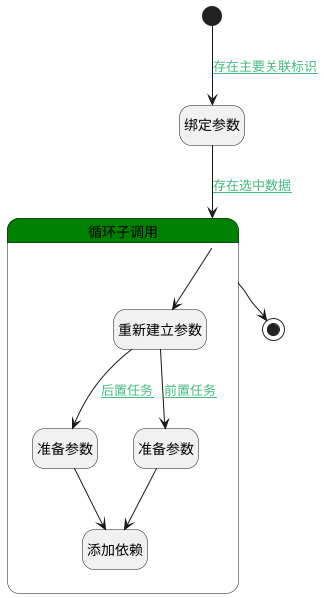

## 工作项添加依赖 <!-- {docsify-ignore-all} -->

   工作项添加依赖

### 处理过程




### 处理步骤说明

#### 开始 :id=Begin<sup class="footnote-symbol"> <font color=gray size=1>[开始]</font></sup>


*- N/A*
#### 绑定参数 :id=BINDPARAM1<sup class="footnote-symbol"> <font color=gray size=1>[绑定参数]</font></sup>


绑定参数`Default(传入变量)` 到 `selectdata(关联列表)`
#### 准备参数 :id=PREPAREPARAM1<sup class="footnote-symbol"> <font color=gray size=1>[准备参数]</font></sup>


1. 将`for_temp_obj(循环临时变量).owner_id` 设置给  `dependency(依赖).PRINCIPAL_ID(关联主体标识)`
2. 将`dependency` 设置给  `dependency(依赖).PRINCIPAL_TYPE(关联主体类型)`
3. 将`Default(传入变量).PRINCIPAL_ID(关联主体标识)` 设置给  `dependency(依赖).TARGET_ID(关联目标标识)`
4. 将`1` 设置给  `dependency(依赖).RELATION_TYPE(关联类型)`

#### 循环子调用 :id=LOOPSUBCALL1<sup class="footnote-symbol"> <font color=gray size=1>[循环子调用]</font></sup>


循环参数`selectdata(关联列表)`，子循环参数使用`for_temp_obj(循环临时变量)`
#### 重新建立参数 :id=RENEWPARAM1<sup class="footnote-symbol"> <font color=gray size=1>[重新建立参数]</font></sup>


重建参数```dependency(依赖)```
#### 添加依赖 :id=DEACTION1<sup class="footnote-symbol"> <font color=gray size=1>[实体行为]</font></sup>


调用实体 [关联(RELATION)](module/Base/relation.md) 行为 [Save](module/Base/relation#行为) ，行为参数为`dependency(依赖)`

#### 准备参数 :id=PREPAREPARAM2<sup class="footnote-symbol"> <font color=gray size=1>[准备参数]</font></sup>


1. 将`dependency` 设置给  `dependency(依赖).PRINCIPAL_TYPE(关联主体类型)`
2. 将`1` 设置给  `dependency(依赖).RELATION_TYPE(关联类型)`
3. 将`for_temp_obj(循环临时变量).owner_id` 设置给  `dependency(依赖).TARGET_ID(关联目标标识)`
4. 将`Default(传入变量).PRINCIPAL_ID(关联主体标识)` 设置给  `dependency(依赖).PRINCIPAL_ID(关联主体标识)`

#### 结束 :id=END1<sup class="footnote-symbol"> <font color=gray size=1>[结束]</font></sup>


返回 `Default(传入变量)`


### 连接条件说明
#### 存在主要关联标识 :id=Begin-BINDPARAM1

`Default(传入变量).principal_id(关联主体标识)` ISNOTNULL
#### 存在选中数据 :id=BINDPARAM1-LOOPSUBCALL1

`selectdata(关联列表).size` GT `0`
#### 后置任务 :id=RENEWPARAM1-PREPAREPARAM2

`Default(传入变量).RELATION_TYPE(关联类型)` EQ `after`
#### 前置任务 :id=RENEWPARAM1-PREPAREPARAM1

`Default(传入变量).RELATION_TYPE(关联类型)` EQ `front`


### 实体逻辑参数

|    中文名   |    代码名    |  数据类型    |  实体   |备注 |
| --------| --------| -------- | -------- | --------   |
|传入变量(<i class="fa fa-check"/></i>)|Default|数据对象|[关联(RELATION)](module/Base/relation.md)||
|依赖|dependency|数据对象|[关联(RELATION)](module/Base/relation.md)||
|循环临时变量|for_temp_obj|数据对象|[关联(RELATION)](module/Base/relation.md)||
|关联列表|selectdata|数据对象列表|[关联(RELATION)](module/Base/relation.md)||
