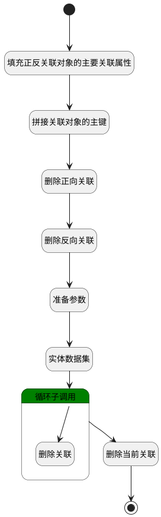

## 取消关联 <!-- {docsify-ignore-all} -->

   工作项取消关联数据（正反向关联数据同时删除）

### 处理过程




### 处理步骤说明

#### 开始 :id=Begin<sup class="footnote-symbol"> <font color=gray size=1>[开始]</font></sup>


*- N/A*
#### 填充正反关联对象的主要关联属性 :id=PREPAREPARAM1<sup class="footnote-symbol"> <font color=gray size=1>[准备参数]</font></sup>


1. 将`Default(传入变量).PRINCIPAL_ID(关联主体标识)` 设置给  `forward_relation_obj(正向关联对象).PRINCIPAL_ID(关联主体标识)`
2. 将`Default(传入变量).PRINCIPAL_TYPE(关联主体类型)` 设置给  `forward_relation_obj(正向关联对象).PRINCIPAL_TYPE(关联主体类型)`
3. 将`Default(传入变量).TARGET_TYPE(关联目标类型)` 设置给  `reverse_relation_obj(反向关联对象).PRINCIPAL_TYPE(关联主体类型)`
4. 将`Default(传入变量).PRINCIPAL_ID(关联主体标识)` 设置给  `reverse_relation_obj(反向关联对象).TARGET_ID(目标主体标识)`
5. 将`Default(传入变量).TARGET_ID(目标主体标识)` 设置给  `reverse_relation_obj(反向关联对象).PRINCIPAL_ID(关联主体标识)`
6. 将`Default(传入变量).TARGET_ID(目标主体标识)` 设置给  `forward_relation_obj(正向关联对象).TARGET_ID(目标主体标识)`

#### 拼接关联对象的主键 :id=RAWSFCODE1<sup class="footnote-symbol"> <font color=gray size=1>[直接后台代码]</font></sup>


<p class="panel-title"><b>执行代码[JavaScript]</b></p>

```javascript
// 获取正向关联对象的主键
var forward_relation_obj = logic.getParam("forward_relation_obj");
if(forward_relation_obj.get("principal_id") != null && forward_relation_obj.get("target_id") != null && forward_relation_obj.get("principal_type") != null){
    forward_relation_obj.set("id", forward_relation_obj.get("principal_id") + "_" + forward_relation_obj.get("target_id") + '_' + forward_relation_obj.get("principal_type"));
}
// 获取反向关联对象的主键
var reverse_relation_obj = logic.getParam("reverse_relation_obj");
if(reverse_relation_obj.get("principal_id") != null && reverse_relation_obj.get("target_id") != null && reverse_relation_obj.get("principal_type") != null){
    reverse_relation_obj.set("id", reverse_relation_obj.get("principal_id") + "_" + reverse_relation_obj.get("target_id") + '_' + reverse_relation_obj.get("principal_type"));
}
```

#### 删除正向关联 :id=DEACTION2<sup class="footnote-symbol"> <font color=gray size=1>[实体行为]</font></sup>


调用实体 [关联(RELATION)](module/Base/relation.md) 行为 [Remove](module/Base/relation#行为) ，行为参数为`forward_relation_obj(正向关联对象)`

#### 删除反向关联 :id=DEACTION3<sup class="footnote-symbol"> <font color=gray size=1>[实体行为]</font></sup>


调用实体 [关联(RELATION)](module/Base/relation.md) 行为 [Remove](module/Base/relation#行为) ，行为参数为`reverse_relation_obj(反向关联对象)`

#### 准备参数 :id=PREPAREPARAM2<sup class="footnote-symbol"> <font color=gray size=1>[准备参数]</font></sup>


1. 将`Default(传入变量).TARGET_ID(目标主体标识)` 设置给  `filter.N_PRINCIPAL_ID_EQ`
2. 将`Default(传入变量).PRINCIPAL_ID(关联主体标识)` 设置给  `filter.N_TARGET_ID_EQ`

#### 实体数据集 :id=DEDATASET1<sup class="footnote-symbol"> <font color=gray size=1>[实体数据集]</font></sup>


调用实体 [关联(RELATION)](module/Base/relation.md) 数据集合 [数据集(DEFAULT)](module/Base/relation#数据集合) ，查询参数为`filter`

将执行结果返回给参数`page`

#### 循环子调用 :id=LOOPSUBCALL1<sup class="footnote-symbol"> <font color=gray size=1>[循环子调用]</font></sup>


循环参数`page`，子循环参数使用`temp`
#### 删除关联 :id=DEACTION4<sup class="footnote-symbol"> <font color=gray size=1>[实体行为]</font></sup>


调用实体 [关联(RELATION)](module/Base/relation.md) 行为 [Remove](module/Base/relation#行为) ，行为参数为`temp`

#### 删除当前关联 :id=DEACTION5<sup class="footnote-symbol"> <font color=gray size=1>[实体行为]</font></sup>


调用实体 [关联(RELATION)](module/Base/relation.md) 行为 [Remove](module/Base/relation#行为) ，行为参数为`Default(传入变量)`

#### 结束 :id=END1<sup class="footnote-symbol"> <font color=gray size=1>[结束]</font></sup>


*- N/A*


### 实体逻辑参数

|    中文名   |    代码名    |  数据类型    |  实体   |备注 |
| --------| --------| -------- | -------- | --------   |
|传入变量(<i class="fa fa-check"/></i>)|Default|数据对象|[关联(RELATION)](module/Base/relation.md)||
|filter|filter|过滤器|||
|正向关联对象|forward_relation_obj|数据对象|[关联(RELATION)](module/Base/relation.md)||
|page|page|分页查询|||
|反向关联对象|reverse_relation_obj|数据对象|[关联(RELATION)](module/Base/relation.md)||
|temp|temp|数据对象|[关联(RELATION)](module/Base/relation.md)||
