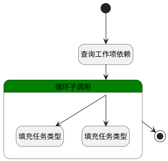

## 区分前后置任务 <!-- {docsify-ignore-all} -->

   工作项依赖：区分前后置任务

### 处理过程

### 处理步骤说明

#### 开始 :id=Begin [开始]

*- N/A*
#### 查询工作项依赖 :id=DEDATASET1 [实体数据集]

调用实体 [关联(RELATION)](module/Base/relation.md) 数据集合 [工作项依赖(dependency_work_items)](module/Base/relation#数据集合) ，查询参数为`Default(传入变量)`

将执行结果返回给参数`result_page(分页查询结果变量)`

#### 填充任务类型 :id=PREPAREPARAM1 [准备参数]

1. 将`after` 设置给  `for_obj(循环临时变量对象).JOB_TYPE(前后置任务)`
2. 将`for_obj(循环临时变量对象).TARGET_ID(关联目标标识)` 设置给  `for_obj(循环临时变量对象).link_id`

#### 循环子调用 :id=LOOPSUBCALL1 [循环子调用]

循环参数`result_page(分页查询结果变量)`，子循环参数使用`for_obj(循环临时变量对象)`
#### 填充任务类型 :id=PREPAREPARAM2 [准备参数]

1. 将`front` 设置给  `for_obj(循环临时变量对象).JOB_TYPE(前后置任务)`
2. 将`for_obj(循环临时变量对象).PRINCIPAL_ID(关联主体标识)` 设置给  `for_obj(循环临时变量对象).link_id`

#### 结束 :id=END1 [结束]

返回 `result_page(分页查询结果变量)`

### 连接条件说明
#### 后置任务 

#### 前置任务 

### 实体逻辑参数

|    中文名   |    代码名    |  数据类型    |  实体   |备注 |
| --------| --------| -------- | -------- | --------   |
|传入变量(<i class="fa fa-check"/></i>)|Default|过滤器|||
|循环临时变量对象|for_obj|数据对象|[关联(RELATION)](module/Base/relation.md)||
|分页查询结果变量|result_page|分页查询|||
