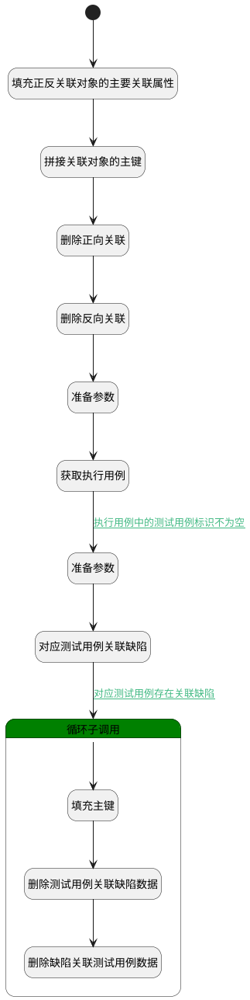

## 执行用例取消关联缺陷 <!-- {docsify-ignore-all} -->

   1.执行用例取消关联缺陷 2.对应测试用例取消关联缺陷

### 处理过程




### 处理步骤说明

#### 开始 :id=Begin<sup class="footnote-symbol"> <font color=gray size=1>[开始]</font></sup>


*- N/A*
#### 填充正反关联对象的主要关联属性 :id=PREPAREPARAM1<sup class="footnote-symbol"> <font color=gray size=1>[准备参数]</font></sup>


1. 将`Default(传入变量).PRINCIPAL_ID(关联主体标识)` 设置给  `forward_relation_obj(正向关联对象).PRINCIPAL_ID(关联主体标识)`
2. 将`Default(传入变量).PRINCIPAL_ID(关联主体标识)` 设置给  `reverse_relation_obj(反向关联对象).TARGET_ID(关联目标标识)`
3. 将`Default(传入变量).TARGET_ID(关联目标标识)` 设置给  `reverse_relation_obj(反向关联对象).PRINCIPAL_ID(关联主体标识)`
4. 将`Default(传入变量).TARGET_ID(关联目标标识)` 设置给  `forward_relation_obj(正向关联对象).TARGET_ID(关联目标标识)`

#### 拼接关联对象的主键 :id=RAWSFCODE1<sup class="footnote-symbol"> <font color=gray size=1>[直接后台代码]</font></sup>


<p class="panel-title"><b>执行代码[JavaScript]</b></p>

```javascript
// 获取正向关联对象的主键
var forward_relation_obj = logic.getParam("forward_relation_obj");
if(forward_relation_obj.get("principal_id") != null && forward_relation_obj.get("target_id") != null){
    forward_relation_obj.set("id", forward_relation_obj.get("principal_id") + "_" + forward_relation_obj.get("target_id"));
}
// 获取反向关联对象的主键
var reverse_relation_obj = logic.getParam("reverse_relation_obj");
if(reverse_relation_obj.get("principal_id") != null && reverse_relation_obj.get("target_id") != null){
    reverse_relation_obj.set("id", reverse_relation_obj.get("principal_id") + "_" + reverse_relation_obj.get("target_id"));
}
```

#### 删除正向关联 :id=DEACTION2<sup class="footnote-symbol"> <font color=gray size=1>[实体行为]</font></sup>


调用实体 [关联(RELATION)](module/Base/relation.md) 行为 [Remove](module/Base/relation#行为) ，行为参数为`forward_relation_obj(正向关联对象)`

#### 删除反向关联 :id=DEACTION3<sup class="footnote-symbol"> <font color=gray size=1>[实体行为]</font></sup>


调用实体 [关联(RELATION)](module/Base/relation.md) 行为 [Remove](module/Base/relation#行为) ，行为参数为`reverse_relation_obj(反向关联对象)`

#### 准备参数 :id=PREPAREPARAM3<sup class="footnote-symbol"> <font color=gray size=1>[准备参数]</font></sup>


1. 将`Default(传入变量).PRINCIPAL_ID(关联主体标识)` 设置给  `run(执行用例).ID(标识)`

#### 获取执行用例 :id=DEACTION6<sup class="footnote-symbol"> <font color=gray size=1>[实体行为]</font></sup>


调用实体 [执行用例(RUN)](module/TestMgmt/run.md) 行为 [Get](module/TestMgmt/run#行为) ，行为参数为`run(执行用例)`

将执行结果返回给参数`run(执行用例)`

#### 准备参数 :id=PREPAREPARAM2<sup class="footnote-symbol"> <font color=gray size=1>[准备参数]</font></sup>


1. 将`Default(传入变量).TARGET_ID(关联目标标识)` 设置给  `relation_filter(关联数据查询过滤器).n_target_id_eq`
2. 将`work_item` 设置给  `relation_filter(关联数据查询过滤器).n_target_type_eq`
3. 将`run(执行用例).CASE_ID(测试用例标识)` 设置给  `relation_filter(关联数据查询过滤器).n_principal_id_eq`
4. 将`test_case` 设置给  `relation_filter(关联数据查询过滤器).n_principal_type_eq`

#### 对应测试用例关联缺陷 :id=DEDATASET1<sup class="footnote-symbol"> <font color=gray size=1>[实体数据集]</font></sup>


调用实体 [关联(RELATION)](module/Base/relation.md) 数据集合 [数据集(DEFAULT)](module/Base/relation#数据集合) ，查询参数为`relation_filter(关联数据查询过滤器)`

将执行结果返回给参数`relation_page(关联数据分页查询结果变量)`

#### 循环子调用 :id=LOOPSUBCALL1<sup class="footnote-symbol"> <font color=gray size=1>[循环子调用]</font></sup>


循环参数`relation_page(关联数据分页查询结果变量)`，子循环参数使用`for_temp_obj(循环临时变量)`
#### 填充主键 :id=RAWSFCODE2<sup class="footnote-symbol"> <font color=gray size=1>[直接后台代码]</font></sup>


<p class="panel-title"><b>执行代码[JavaScript]</b></p>

```javascript
var for_temp_obj = logic.getParam("for_temp_obj");
var test_case_relation_bug = logic.getParam("test_case_relation_bug");
var bug_relation_test_case = logic.getParam("bug_relation_test_case");
if(for_temp_obj.get("principal_id") != null && for_temp_obj.get("target_id") != null){
    // 获取测试用例关联缺陷对象的主键
    test_case_relation_bug.set("id", for_temp_obj.get("principal_id") + "_" + for_temp_obj.get("target_id"));
    // 获取缺陷关联测试用例对象的主键
    bug_relation_test_case.set("id", for_temp_obj.get("target_id") + "_" + for_temp_obj.get("principal_id"));
}
```

#### 删除测试用例关联缺陷数据 :id=DEACTION4<sup class="footnote-symbol"> <font color=gray size=1>[实体行为]</font></sup>


调用实体 [关联(RELATION)](module/Base/relation.md) 行为 [Remove](module/Base/relation#行为) ，行为参数为`test_case_relation_bug(测试用例关联缺陷)`

#### 删除缺陷关联测试用例数据 :id=DEACTION5<sup class="footnote-symbol"> <font color=gray size=1>[实体行为]</font></sup>


调用实体 [关联(RELATION)](module/Base/relation.md) 行为 [Remove](module/Base/relation#行为) ，行为参数为`bug_relation_test_case(缺陷关联测试用例)`


### 连接条件说明
#### 执行用例中的测试用例标识不为空 :id=DEACTION6-PREPAREPARAM2

`run(执行用例).case_id(测试用例标识)` ISNOTNULL
#### 对应测试用例存在关联缺陷 :id=DEDATASET1-LOOPSUBCALL1

`relation_page(关联数据分页查询结果变量).size` GT `0`


### 实体逻辑参数

|    中文名   |    代码名    |  数据类型    |  实体   |备注 |
| --------| --------| -------- | -------- | --------   |
|传入变量(<i class="fa fa-check"/></i>)|Default|数据对象|[关联(RELATION)](module/Base/relation.md)||
|缺陷关联测试用例|bug_relation_test_case|数据对象|[关联(RELATION)](module/Base/relation.md)||
|循环临时变量|for_temp_obj|数据对象|[关联(RELATION)](module/Base/relation.md)||
|正向关联对象|forward_relation_obj|数据对象|[关联(RELATION)](module/Base/relation.md)||
|关联数据查询过滤器|relation_filter|过滤器|||
|关联数据分页查询结果变量|relation_page|分页查询|||
|反向关联对象|reverse_relation_obj|数据对象|[关联(RELATION)](module/Base/relation.md)||
|执行用例|run|数据对象|[执行用例(RUN)](module/TestMgmt/run.md)||
|测试用例关联缺陷|test_case_relation_bug|数据对象|[关联(RELATION)](module/Base/relation.md)||
