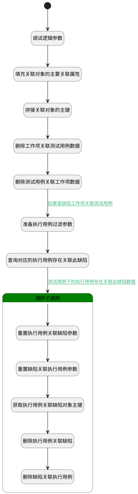

## 工作项取消关联测试用例 <!-- {docsify-ignore-all} -->

   1.工作项取消关联对应测试用例 2.判断是缺陷类型工作项时检验是否需删除执行用例关联

### 处理过程




### 处理步骤说明

#### 开始 :id=Begin<sup class="footnote-symbol"> <font color=gray size=1>[开始]</font></sup>


*- N/A*
#### 调试逻辑参数 :id=DEBUGPARAM1<sup class="footnote-symbol"> <font color=gray size=1>[调试逻辑参数]</font></sup>


> [!NOTE|label:调试信息|icon:fa fa-bug]
> 调试输出参数`Default(传入变量)`的详细信息


#### 填充关联对象的主要关联属性 :id=PREPAREPARAM1<sup class="footnote-symbol"> <font color=gray size=1>[准备参数]</font></sup>


1. 将`Default(传入变量).PRINCIPAL_ID(关联主体标识)` 设置给  `forward_relation_obj(正向关联对象).PRINCIPAL_ID(关联主体标识)`
2. 将`Default(传入变量).PRINCIPAL_TYPE(关联主体类型)` 设置给  `forward_relation_obj(正向关联对象).PRINCIPAL_TYPE(关联主体类型)`
3. 将`Default(传入变量).TARGET_TYPE(关联目标类型)` 设置给  `reverse_relation_obj(反向关联对象).PRINCIPAL_TYPE(关联主体类型)`
4. 将`Default(传入变量).PRINCIPAL_ID(关联主体标识)` 设置给  `reverse_relation_obj(反向关联对象).TARGET_ID(目标主体标识)`
5. 将`Default(传入变量).TARGET_ID(目标主体标识)` 设置给  `reverse_relation_obj(反向关联对象).PRINCIPAL_ID(关联主体标识)`
6. 将`Default(传入变量).TARGET_ID(目标主体标识)` 设置给  `forward_relation_obj(正向关联对象).TARGET_ID(目标主体标识)`

#### 拼接关联对象的主键 :id=RAWSFCODE1<sup class="footnote-symbol"> <font color=gray size=1>[直接后台代码]</font></sup>


<p class="panel-title"><b>执行代码[JavaScript]</b></p>

```javascript
// 获取正向关联对象的主键
var forward_relation_obj = logic.getParam("forward_relation_obj");
if(forward_relation_obj.get("principal_id") != null && forward_relation_obj.get("target_id") != null){
    forward_relation_obj.set("id", forward_relation_obj.get("principal_id") + "_" + forward_relation_obj.get("target_id")+ '_' + forward_relation_obj.get("principal_type"));
}
// 获取反向关联对象的主键
var reverse_relation_obj = logic.getParam("reverse_relation_obj");
if(reverse_relation_obj.get("principal_id") != null && reverse_relation_obj.get("target_id") != null){
    reverse_relation_obj.set("id", reverse_relation_obj.get("principal_id") + "_" + reverse_relation_obj.get("target_id")+ '_' + forward_relation_obj.get("principal_type"));
}
```

#### 删除工作项关联测试用例数据 :id=DEACTION2<sup class="footnote-symbol"> <font color=gray size=1>[实体行为]</font></sup>


调用实体 [关联(RELATION)](module/Base/relation.md) 行为 [Remove](module/Base/relation#行为) ，行为参数为`forward_relation_obj(正向关联对象)`

#### 删除测试用例关联工作项数据 :id=DEACTION3<sup class="footnote-symbol"> <font color=gray size=1>[实体行为]</font></sup>


调用实体 [关联(RELATION)](module/Base/relation.md) 行为 [Remove](module/Base/relation#行为) ，行为参数为`reverse_relation_obj(反向关联对象)`

#### 准备执行用例过滤参数 :id=PREPAREPARAM2<sup class="footnote-symbol"> <font color=gray size=1>[准备参数]</font></sup>


1. 将`Default(传入变量).PRINCIPAL_ID(关联主体标识)` 设置给  `run_relation_filter(执行用例关联缺陷查询过滤器).target_id(目标主体标识)`
2. 将`Default(传入变量).TARGET_ID(目标主体标识)` 设置给  `run_relation_filter(执行用例关联缺陷查询过滤器).principal_id(关联主体标识)`

#### 查询对应的执行用例存在关联此缺陷 :id=DEDATASET1<sup class="footnote-symbol"> <font color=gray size=1>[实体数据集]</font></sup>


调用实体 [关联(RELATION)](module/Base/relation.md) 数据集合 [测试用例下存在执行用例关联缺陷(exists_run_relation_bug)](module/Base/relation#数据集合) ，查询参数为`run_relation_filter(执行用例关联缺陷查询过滤器)`

将执行结果返回给参数`run_relation_page(执行用例关联缺陷分页结果对象)`

#### 循环子调用 :id=LOOPSUBCALL1<sup class="footnote-symbol"> <font color=gray size=1>[循环子调用]</font></sup>


循环参数`run_relation_page(执行用例关联缺陷分页结果对象)`，子循环参数使用`relation_for_temp_obj(临时循环变量)`
#### 重置执行用例关联缺陷参数 :id=RESETPARAM1<sup class="footnote-symbol"> <font color=gray size=1>[重置参数]</font></sup>


重置参数```run_relation_bug(执行用例关联缺陷)```
#### 重置缺陷关联执行用例参数 :id=RESETPARAM2<sup class="footnote-symbol"> <font color=gray size=1>[重置参数]</font></sup>


重置参数```bug_relation_run(缺陷关联执行用例)```
#### 获取执行用例关联缺陷对象主键 :id=RAWSFCODE2<sup class="footnote-symbol"> <font color=gray size=1>[直接后台代码]</font></sup>


<p class="panel-title"><b>执行代码[JavaScript]</b></p>

```javascript
var relation_for_temp_obj = logic.getParam("relation_for_temp_obj");
var run_relation_bug = logic.getParam("run_relation_bug");
var bug_relation_run = logic.getParam("bug_relation_run");
if(relation_for_temp_obj.get("id") != null && relation_for_temp_obj.get("target_id") != null){
    // 获取执行用例关联缺陷对象的主键
    run_relation_bug.set("id", relation_for_temp_obj.get("principal_id") + "_" + relation_for_temp_obj.get("target_id"));
    // 获取缺陷关联执行用例对象的主键
    bug_relation_run.set("id", relation_for_temp_obj.get("target_id") + "_" + relation_for_temp_obj.get("principal_id"));
}
```

#### 删除执行用例关联缺陷 :id=DEACTION4<sup class="footnote-symbol"> <font color=gray size=1>[实体行为]</font></sup>


调用实体 [关联(RELATION)](module/Base/relation.md) 行为 [Remove](module/Base/relation#行为) ，行为参数为`run_relation_bug(执行用例关联缺陷)`

#### 删除缺陷关联执行用例 :id=DEACTION5<sup class="footnote-symbol"> <font color=gray size=1>[实体行为]</font></sup>


调用实体 [关联(RELATION)](module/Base/relation.md) 行为 [Remove](module/Base/relation#行为) ，行为参数为`bug_relation_run(缺陷关联执行用例)`


### 连接条件说明
#### 如果是缺陷工作项关联测试用例 :id=DEACTION3-PREPAREPARAM2

`Default(传入变量).PRINCIPAL_TYPE(关联主体类型)` EQ `bug`
#### 测试用例下的执行用例存在关联此缺陷数据 :id=DEDATASET1-LOOPSUBCALL1

`run_relation_page(执行用例关联缺陷分页结果对象).size` GT `0`


### 实体逻辑参数

|    中文名   |    代码名    |  数据类型    |  实体   |备注 |
| --------| --------| -------- | -------- | --------   |
|传入变量(<i class="fa fa-check"/></i>)|Default|数据对象|[关联(RELATION)](module/Base/relation.md)||
|缺陷关联执行用例|bug_relation_run|数据对象|[关联(RELATION)](module/Base/relation.md)||
|正向关联对象|forward_relation_obj|数据对象|[关联(RELATION)](module/Base/relation.md)||
|临时循环变量|relation_for_temp_obj|数据对象|[关联(RELATION)](module/Base/relation.md)||
|反向关联对象|reverse_relation_obj|数据对象|[关联(RELATION)](module/Base/relation.md)||
|执行用例关联缺陷|run_relation_bug|数据对象|[关联(RELATION)](module/Base/relation.md)||
|执行用例关联缺陷查询过滤器|run_relation_filter|过滤器|||
|执行用例关联缺陷分页结果对象|run_relation_page|分页查询|||
