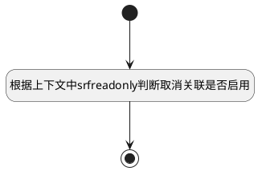

## 取消关联行为是否启用 <!-- {docsify-ignore-all} -->

   用于动态取消关联按钮的启用(target_priority列绑定的界面行为组)

### 处理过程




### 处理步骤说明

#### 开始 :id=Begin<sup class="footnote-symbol"> <font color=gray size=1>[开始]</font></sup>


#### 根据上下文中srfreadonly判断取消关联是否启用 :id=RAWJSCODE1<sup class="footnote-symbol"> <font color=gray size=1>[直接前台代码]</font></sup>


<p class="panel-title"><b>执行代码</b></p>

```javascript

	const rows = uiLogic.grid.state.rows;
	const srfreadonly = context.srfreadonly;
	if (rows && rows.length > 0) {
		rows.forEach(row => {
			const actionColumn = row.uiActionGroupStates.target_priority;
			if (actionColumn && Object.values(actionColumn).length > 0) {
				Object.values(actionColumn).forEach(action => {
                    if(srfreadonly == true){
					    // 取消关联
					    if (action.uiActionId === 'del_relation@relation') {
                            action.disabled = true;
                        }
					    if (action.uiActionId === 'work_item_del_relation_test_case@relation') {
                            action.disabled = true;
                        }
                        if (action.uiActionId === 'test_case_del_relation_bug@relation') {
                            action.disabled = true;
                        }
                        if (action.uiActionId === 'run_del_relation_bug@relation') {
                            action.disabled = true;
                        }
					}
				})
			}
		})
	}

```

#### 结束 :id=END1<sup class="footnote-symbol"> <font color=gray size=1>[结束]</font></sup>


### 实体逻辑参数

|    中文名   |    代码名    |  数据类型      |备注 |
| --------| --------| --------  | --------   |
|传入变量(<i class="fa fa-check"/></i>)|Default|数据对象||
|表格|Grid|当前部件对象||
