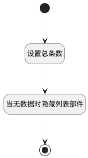

## 依赖列表视图加载完成 <!-- {docsify-ignore-all} -->

   依赖列表视图加载完成

### 处理过程




### 处理步骤说明

#### 开始 :id=Begin<sup class="footnote-symbol"> <font color=gray size=1>[开始]</font></sup>


#### 设置总条数 :id=RAWJSCODE1<sup class="footnote-symbol"> <font color=gray size=1>[直接前台代码]</font></sup>


<p class="panel-title"><b>执行代码</b></p>

```javascript
const total = uiLogic.ctrl.state.total;
uiLogic.view.layoutPanel.state.data.total = total;


```

#### 当无数据时隐藏列表部件 :id=RAWJSCODE2<sup class="footnote-symbol"> <font color=gray size=1>[直接前台代码]</font></sup>


<p class="panel-title"><b>执行代码</b></p>

```javascript
const total = uiLogic.ctrl.state.total;
if(!total){
    view.layoutPanel.panelItems.list.state.visible = false;
}else{
    view.layoutPanel.panelItems.list.state.visible = true;
}
```

#### 结束 :id=END1<sup class="footnote-symbol"> <font color=gray size=1>[结束]</font></sup>


### 实体逻辑参数

|    中文名   |    代码名    |  数据类型      |备注 |
| --------| --------| --------  | --------   |
|传入变量(<i class="fa fa-check"/></i>)|Default|数据对象||
|当前部件对象|CTRL|当前部件对象||
|当前视图对象|VIEW|当前视图对象||
