## 依赖类型值变更 <!-- {docsify-ignore-all} -->

   依赖类型值变更

### 处理过程

```plantuml
@startuml
hide footbox
<style>
root {
  HyperlinkColor #42b983
}
</style>

hide empty description
state "开始" as Begin <<start>> [[$./dependency_onchange#begin {开始}]]
state "准备关系参数" as PREPAREJSPARAM1  [[$./dependency_onchange#preparejsparam1 {准备关系参数}]]
state "更新关系信息" as DEACTION1  [[$./dependency_onchange#deaction1 {更新关系信息}]]
state "结束" as END1 <<end>> [[$./dependency_onchange#end1 {结束}]]


Begin --> PREPAREJSPARAM1 : [[$./dependency_onchange#begin-preparejsparam1{依赖类型不为空} 依赖类型不为空]]
PREPAREJSPARAM1 --> DEACTION1
DEACTION1 --> END1


@enduml
```




### 处理步骤说明

#### 开始 :id=Begin<sup class="footnote-symbol"> <font color=gray size=1>[开始]</font></sup>


#### 准备关系参数 :id=PREPAREJSPARAM1<sup class="footnote-symbol"> <font color=gray size=1>[准备参数]</font></sup>


1. 将`Default(传入变量).id` 设置给  `relation(关联对象).id`
2. 将`Default(传入变量).id` 设置给  `ctx(应用上下文变量).relation`
3. 将`Default(传入变量).relation_type` 设置给  `relation(关联对象).relation_type`

#### 更新关系信息 :id=DEACTION1<sup class="footnote-symbol"> <font color=gray size=1>[实体行为]</font></sup>


调用实体 [关联(RELATION)](module/Base/relation.md) 行为 [Update](module/Base/relation#行为) ，行为参数为`relation(关联对象)`

将执行结果返回给参数`relation(关联对象)`

#### 结束 :id=END1<sup class="footnote-symbol"> <font color=gray size=1>[结束]</font></sup>


### 连接条件说明
#### 依赖类型不为空 :id=Begin-PREPAREJSPARAM1

```Default(传入变量).relation_type``` ISNOTNULL


### 实体逻辑参数

|    中文名   |    代码名    |  数据类型      |备注 |
| --------| --------| --------  | --------   |
|关联对象|relation|数据对象||
|应用上下文变量|ctx|导航视图参数绑定参数||
|传入变量(<i class="fa fa-check"/></i>)|Default|数据对象||
