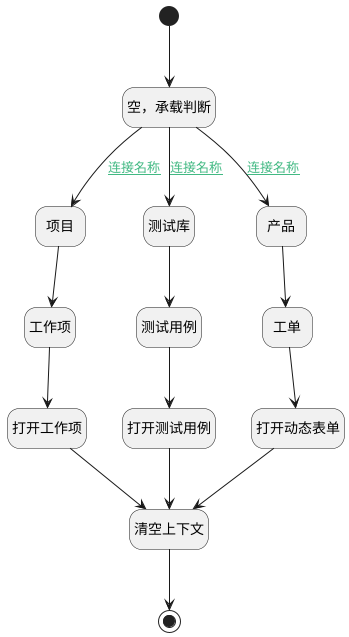

## 跳转对应视图（排期跟踪） <!-- {docsify-ignore-all} -->

   

### 处理过程




### 处理步骤说明

#### 开始 :id=Begin<sup class="footnote-symbol"> <font color=gray size=1>[开始]</font></sup>


#### 空，承载判断 :id=PREPAREJSPARAM1<sup class="footnote-symbol"> <font color=gray size=1>[准备参数]</font></sup>


    无

#### 产品 :id=PREPAREJSPARAM2<sup class="footnote-symbol"> <font color=gray size=1>[准备参数]</font></sup>


1. 将`Default(传入变量).product_id` 设置给  `ctx(上下文).product`

#### 项目 :id=PREPAREJSPARAM4<sup class="footnote-symbol"> <font color=gray size=1>[准备参数]</font></sup>


    无

#### 测试库 :id=PREPAREJSPARAM3<sup class="footnote-symbol"> <font color=gray size=1>[准备参数]</font></sup>


    无

#### 工单 :id=PREPAREJSPARAM7<sup class="footnote-symbol"> <font color=gray size=1>[准备参数]</font></sup>


1. 将`Default(传入变量).id` 设置给  `ctx(上下文).ticket`

#### 工作项 :id=PREPAREJSPARAM9<sup class="footnote-symbol"> <font color=gray size=1>[准备参数]</font></sup>


1. 将`Default(传入变量).id` 设置给  `ctx(上下文).work_item`
2. 将`Default(传入变量).project_id` 设置给  `ctx(上下文).project`

#### 测试用例 :id=PREPAREJSPARAM8<sup class="footnote-symbol"> <font color=gray size=1>[准备参数]</font></sup>


1. 将`Default(传入变量).id` 设置给  `ctx(上下文).test_case`
2. 将`Default(传入变量).test_library_id` 设置给  `ctx(上下文).library`

#### 打开工作项 :id=DEUIACTION2<sup class="footnote-symbol"> <font color=gray size=1>[实体界面行为调用]</font></sup>


调用实体 [工作项(WORK_ITEM)](module/ProjMgmt/work_item.md) 界面行为 [打开工作项主视图](module/ProjMgmt/work_item#界面行为) ，行为参数为`Default(传入变量)`

#### 打开动态表单 :id=DEUIACTION4<sup class="footnote-symbol"> <font color=gray size=1>[实体界面行为调用]</font></sup>


调用实体 [工单(TICKET)](module/ProdMgmt/ticket.md) 界面行为 [打开动态工单](module/ProdMgmt/ticket#界面行为) ，行为参数为`Default(传入变量)`

#### 打开测试用例 :id=DEUIACTION3<sup class="footnote-symbol"> <font color=gray size=1>[实体界面行为调用]</font></sup>


调用实体 [用例(TEST_CASE)](module/TestMgmt/test_case.md) 界面行为 [打开测试用例（动态）](module/TestMgmt/test_case#界面行为) ，行为参数为`Default(传入变量)`

#### 清空上下文 :id=PREPAREJSPARAM11<sup class="footnote-symbol"> <font color=gray size=1>[准备参数]</font></sup>


1. 将`空值（NULL）` 设置给  `ctx(上下文).library`
2. 将`空值（NULL）` 设置给  `ctx(上下文).product`
3. 将`空值（NULL）` 设置给  `ctx(上下文).project`
4. 将`空值（NULL）` 设置给  `ctx(上下文).project`

#### 结束 :id=END1<sup class="footnote-symbol"> <font color=gray size=1>[结束]</font></sup>


### 连接条件说明
#### 连接名称 :id=PREPAREJSPARAM1-PREPAREJSPARAM3

```Default(传入变量).test_library_id``` ISNOTNULL
#### 连接名称 :id=PREPAREJSPARAM1-PREPAREJSPARAM2

```Default(传入变量).product_id``` ISNOTNULL
#### 连接名称 :id=PREPAREJSPARAM1-PREPAREJSPARAM4

```Default(传入变量).project_id``` ISNOTNULL


### 实体逻辑参数

|    中文名   |    代码名    |  数据类型      |备注 |
| --------| --------| --------  | --------   |
|临时对象|temp_obj|数据对象||
|上下文|ctx|导航视图参数绑定参数||
|临时对象分页结果|temp_obj_page|分页查询||
|临时对象过滤器|temp_obj_filter|过滤器||
|传入变量(<i class="fa fa-check"/></i>)|Default|数据对象||
