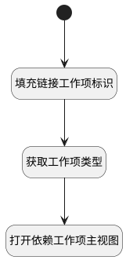

## 打开依赖工作项 <!-- {docsify-ignore-all} -->

   打开依赖工作项主视图

### 处理过程

### 处理步骤说明

#### 开始 :id=Begin [开始]

#### 填充链接工作项标识 :id=PREPAREJSPARAM1 [准备参数]

1. 将`Default(传入变量).link_id` 设置给  `work_item(工作项).id`
2. 将`Default(传入变量).link_id` 设置给  `ctx(应用上下文变量).work_item`

#### 获取工作项类型 :id=DEACTION1 [实体行为]

调用实体 [工作项(WORK_ITEM)](module/ProjMgmt/work_item.md) 行为 [获取工作项类型(work_item_type_id)](module/ProjMgmt/work_item#行为) ，行为参数为`work_item(工作项)`

将执行结果返回给参数`work_item(工作项)`

#### 打开依赖工作项主视图 :id=DEUIACTION1 [实体界面行为调用]

调用实体 [关联(RELATION)](module/Base/relation.md) 界面行为 [打开依赖工作项主视图](module/Base/relation#界面行为) ，行为参数为`work_item(工作项)`

### 实体逻辑参数

|    中文名   |    代码名    |  数据类型      |备注 |
| --------| --------| --------  | --------   |
|应用上下文变量|ctx|导航视图参数绑定参数||
|工作项|work_item|数据对象||
|传入变量(<i class="fa fa-check"/></i>)|Default|数据对象||
