## 打开需求（跟踪） <!-- {docsify-ignore-all} -->

   

### 处理过程

```plantuml
@startuml
hide footbox
<style>
root {
  HyperlinkColor #42b983
}
</style>

hide empty description
state "开始" as Begin <<start>> [[$./open_idea_view#begin {开始}]]
state "界面行为" as DEUIACTION1  [[$./open_idea_view#deuiaction1 {界面行为}]]
state "准备参数" as PREPAREJSPARAM1  [[$./open_idea_view#preparejsparam1 {准备参数}]]
state "结束" as END1 <<end>> [[$./open_idea_view#end1 {结束}]]


Begin --> PREPAREJSPARAM1
PREPAREJSPARAM1 --> DEUIACTION1
DEUIACTION1 --> END1


@enduml
```

### 处理步骤说明

#### 开始 :id=Begin [开始]

#### 结束 :id=END1 [结束]

#### 准备参数 :id=PREPAREJSPARAM1 [准备参数]

1. 将`Default(传入变量).product_id` 设置给  `ctx(上下文).product`
2. 将`Default(传入变量).id` 设置给  `ctx(上下文).idea`

#### 界面行为 :id=DEUIACTION1 [实体界面行为调用]

调用实体 [需求(IDEA)](module/ProdMgmt/idea.md) 界面行为 [打开动态需求](module/ProdMgmt/idea#界面行为) ，行为参数为`Default(传入变量)`

### 实体逻辑参数

|    中文名   |    代码名    |  数据类型      |备注 |
| --------| --------| --------  | --------   |
|上下文|ctx|导航视图参数绑定参数||
|传入变量(<i class="fa fa-check"/></i>)|Default|数据对象||
