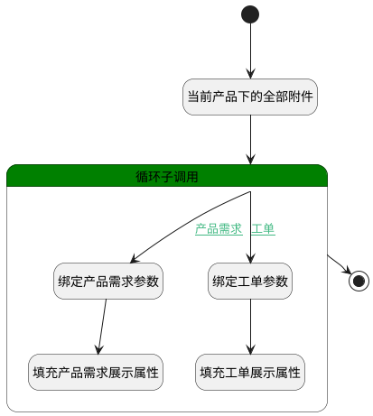

## 产品中需求或工单的附件 <!-- {docsify-ignore-all} -->

   当前产品下的全部附件，用于填充所属相关信息字段

### 处理过程

### 处理步骤说明

#### 开始 :id=Begin [开始]

*- N/A*
#### 当前产品下的全部附件 :id=DEDATASET1 [实体数据集]

调用实体 [附件搜索(SEARCH_ATTACHMENT)](module/Base/search_attachment.md) 数据集合 [当前产品下的附件(cur_product)](module/Base/search_attachment#数据集合) ，查询参数为`Default(传入变量)`

将执行结果返回给参数`result_page(分页查询结果变量)`

#### 绑定产品需求参数 :id=BINDPARAM2 [绑定参数]

绑定参数`for_temp_obj(循环临时变量)` 到 `idea(产品需求)`
#### 填充产品需求展示属性 :id=PREPAREPARAM2 [准备参数]

1. 将`idea(产品需求).IDENTIFIER(编号)` 设置给  `for_temp_obj(循环临时变量).OWNER_IDENTIFIER(所属数据编号)`
2. 将`idea(产品需求).PRODUCT_ID(产品)` 设置给  `for_temp_obj(循环临时变量).OWNER_PARENT_ID(所属数据父标识)`
3. 将`idea(产品需求).PRODUCT_NAME(所属产品)` 设置给  `for_temp_obj(循环临时变量).OWNER_PARENT_NAME(所属数据父名称)`
4. 将`idea(产品需求).TITLE(标题)` 设置给  `for_temp_obj(循环临时变量).OWNER_TITLE(所属数据标题)`

#### 循环子调用 :id=LOOPSUBCALL1 [循环子调用]

循环参数`result_page(分页查询结果变量)`，子循环参数使用`for_temp_obj(循环临时变量)`
#### 绑定工单参数 :id=BINDPARAM3 [绑定参数]

绑定参数`for_temp_obj(循环临时变量)` 到 `ticket(工单)`
#### 填充工单展示属性 :id=PREPAREPARAM3 [准备参数]

1. 将`ticket(工单).TITLE(标题)` 设置给  `for_temp_obj(循环临时变量).OWNER_TITLE(所属数据标题)`
2. 将`ticket(工单).PRODUCT_ID(产品标识)` 设置给  `for_temp_obj(循环临时变量).OWNER_PARENT_ID(所属数据父标识)`
3. 将`ticket(工单).PRODUCT_NAME(所属产品)` 设置给  `for_temp_obj(循环临时变量).OWNER_PARENT_NAME(所属数据父名称)`
4. 将`ticket(工单).IDENTIFIER(编号)` 设置给  `for_temp_obj(循环临时变量).OWNER_IDENTIFIER(所属数据编号)`

#### 结束 :id=END1 [结束]

返回 `result_page(分页查询结果变量)`

### 连接条件说明
#### 产品需求 :id=LOOPSUBCALL1-BINDPARAM2

`for_temp_obj(循环临时变量).OWNER_TYPE(所属数据对象)` EQ `IDEA`
#### 工单 :id=LOOPSUBCALL1-BINDPARAM3

`for_temp_obj(循环临时变量).OWNER_TYPE(所属数据对象)` EQ `TICKET`

### 实体逻辑参数

|    中文名   |    代码名    |  数据类型    |  实体   |备注 |
| --------| --------| -------- | -------- | --------   |
|传入变量(<i class="fa fa-check"/></i>)|Default|过滤器|||
|循环临时变量|for_temp_obj|数据对象|[附件搜索(SEARCH_ATTACHMENT)](module/Base/search_attachment.md)||
|产品需求|idea|数据对象|[需求(IDEA)](module/ProdMgmt/idea.md)||
|分页查询结果变量|result_page|分页查询|||
|工单|ticket|数据对象|[工单(TICKET)](module/ProdMgmt/ticket.md)||
