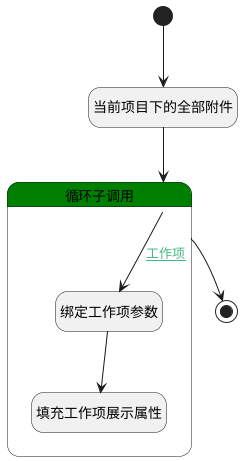

## 项目中工作项的附件 <!-- {docsify-ignore-all} -->

   当前项目下的全部附件，用于填充所属相关信息字段

### 处理过程

### 处理步骤说明

#### 开始 :id=Begin [开始]

*- N/A*
#### 当前项目下的全部附件 :id=DEDATASET1 [实体数据集]

调用实体 [附件搜索(SEARCH_ATTACHMENT)](module/Base/search_attachment.md) 数据集合 [当前项目下的附件(cur_project)](module/Base/search_attachment#数据集合) ，查询参数为`Default(传入变量)`

将执行结果返回给参数`result_page(分页查询结果变量)`

#### 循环子调用 :id=LOOPSUBCALL1 [循环子调用]

循环参数`result_page(分页查询结果变量)`，子循环参数使用`for_temp_obj(循环临时变量)`
#### 绑定工作项参数 :id=BINDPARAM1 [绑定参数]

绑定参数`for_temp_obj(循环临时变量)` 到 `work_item(工作项)`
#### 填充工作项展示属性 :id=PREPAREPARAM1 [准备参数]

1. 将`work_item(工作项).IDENTIFIER(编号)` 设置给  `for_temp_obj(循环临时变量).OWNER_IDENTIFIER(所属数据编号)`
2. 将`work_item(工作项).PROJECT_ID(项目)` 设置给  `for_temp_obj(循环临时变量).OWNER_PARENT_ID(所属数据父标识)`
3. 将`work_item(工作项).PROJECT_NAME(所属项目)` 设置给  `for_temp_obj(循环临时变量).OWNER_PARENT_NAME(所属数据父名称)`
4. 将`work_item(工作项).TITLE(标题)` 设置给  `for_temp_obj(循环临时变量).OWNER_TITLE(所属数据标题)`

#### 结束 :id=END1 [结束]

返回 `result_page(分页查询结果变量)`

### 连接条件说明
#### 工作项 :id=LOOPSUBCALL1-BINDPARAM1

`for_temp_obj(循环临时变量).OWNER_TYPE(所属数据对象)` EQ `WORK_ITEM`

### 实体逻辑参数

|    中文名   |    代码名    |  数据类型    |  实体   |备注 |
| --------| --------| -------- | -------- | --------   |
|传入变量(<i class="fa fa-check"/></i>)|Default|过滤器|||
|客户|customer|数据对象|[客户(CUSTOMER)](module/ProdMgmt/customer.md)||
|循环临时变量|for_temp_obj|数据对象|[附件搜索(SEARCH_ATTACHMENT)](module/Base/search_attachment.md)||
|产品需求|idea|数据对象|[需求(IDEA)](module/ProdMgmt/idea.md)||
|页面|page|数据对象|[页面(PAGE)](module/Wiki/article_page.md)||
|分页查询结果变量|result_page|分页查询|||
|测试用例|test_case|数据对象|[用例(TEST_CASE)](module/TestMgmt/test_case.md)||
|工单|ticket|数据对象|[工单(TICKET)](module/ProdMgmt/ticket.md)||
|工作项|work_item|数据对象|[工作项(WORK_ITEM)](module/ProjMgmt/work_item.md)||
