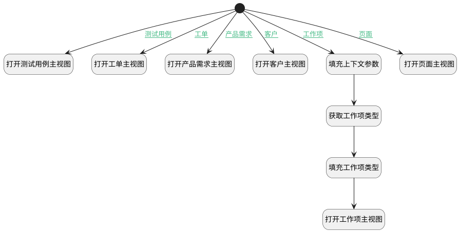

## 打开详情视图 <!-- {docsify-ignore-all} -->

   链接跳转工作项/产品需求/测试用例/工单/客户/页面详情主视图

### 处理过程




### 处理步骤说明

#### 开始 :id=Begin<sup class="footnote-symbol"> <font color=gray size=1>[开始]</font></sup>


#### 填充上下文参数 :id=PREPAREJSPARAM1<sup class="footnote-symbol"> <font color=gray size=1>[准备参数]</font></sup>


1. 将`Default(传入变量).owner_id` 设置给  `work_item(工作项).id`
2. 将`Default(传入变量).owner_id` 设置给  `ctx(应用上下文变量).work_item`
3. 将`Default(传入变量).owner_parent_id` 设置给  `ctx(应用上下文变量).project`

#### 打开测试用例主视图 :id=DEUIACTION2<sup class="footnote-symbol"> <font color=gray size=1>[实体界面行为调用]</font></sup>


调用实体 [附件搜索(SEARCH_ATTACHMENT)](module/Base/search_attachment.md) 界面行为 [打开测试用例主视图](module/Base/search_attachment#界面行为) ，行为参数为`Default(传入变量)`

#### 打开产品需求主视图 :id=DEUIACTION3<sup class="footnote-symbol"> <font color=gray size=1>[实体界面行为调用]</font></sup>


调用实体 [附件搜索(SEARCH_ATTACHMENT)](module/Base/search_attachment.md) 界面行为 [打开产品需求主视图](module/Base/search_attachment#界面行为) ，行为参数为`Default(传入变量)`

#### 打开工单主视图 :id=DEUIACTION4<sup class="footnote-symbol"> <font color=gray size=1>[实体界面行为调用]</font></sup>


调用实体 [附件搜索(SEARCH_ATTACHMENT)](module/Base/search_attachment.md) 界面行为 [打开工单主视图](module/Base/search_attachment#界面行为) ，行为参数为`Default(传入变量)`

#### 打开客户主视图 :id=DEUIACTION5<sup class="footnote-symbol"> <font color=gray size=1>[实体界面行为调用]</font></sup>


调用实体 [附件搜索(SEARCH_ATTACHMENT)](module/Base/search_attachment.md) 界面行为 [打开客户主视图](module/Base/search_attachment#界面行为) ，行为参数为`Default(传入变量)`

####  打开页面主视图 :id=DEUIACTION6<sup class="footnote-symbol"> <font color=gray size=1>[实体界面行为调用]</font></sup>


调用实体 [附件搜索(SEARCH_ATTACHMENT)](module/Base/search_attachment.md) 界面行为 [打开页面主视图](module/Base/search_attachment#界面行为) ，行为参数为`Default(传入变量)`

#### 获取工作项类型 :id=DEACTION1<sup class="footnote-symbol"> <font color=gray size=1>[实体行为]</font></sup>


调用实体 [工作项(WORK_ITEM)](module/ProjMgmt/work_item.md) 行为 [获取工作项类型(work_item_type_id)](module/ProjMgmt/work_item#行为) ，行为参数为`work_item(工作项)`

将执行结果返回给参数`work_item(工作项)`

#### 填充工作项类型 :id=PREPAREJSPARAM2<sup class="footnote-symbol"> <font color=gray size=1>[准备参数]</font></sup>


1. 将`work_item(工作项).work_item_type_id` 设置给  `Default(传入变量).work_item_type_id`

#### 打开工作项主视图 :id=DEUIACTION1<sup class="footnote-symbol"> <font color=gray size=1>[实体界面行为调用]</font></sup>


调用实体 [附件搜索(SEARCH_ATTACHMENT)](module/Base/search_attachment.md) 界面行为 [打开工作项主视图](module/Base/search_attachment#界面行为) ，行为参数为`Default(传入变量)`

### 连接条件说明
#### 工作项 :id=Begin-PREPAREJSPARAM1

```Default(传入变量).owner_type``` EQ ```WORK_ITEM```
#### 测试用例 :id=Begin-DEUIACTION2

```Default(传入变量).owner_type``` EQ ```TEST_CASE```
#### 产品需求 :id=Begin-DEUIACTION3

```Default(传入变量).owner_type``` EQ ```IDEA```
#### 工单 :id=Begin-DEUIACTION4

```Default(传入变量).owner_type``` EQ ```TICKET```
#### 客户 :id=Begin-DEUIACTION5

```Default(传入变量).owner_type``` EQ ```CUSTOMER```
#### 页面 :id=Begin-DEUIACTION6

```Default(传入变量).owner_type``` EQ ```PAGE```


### 实体逻辑参数

|    中文名   |    代码名    |  数据类型      |备注 |
| --------| --------| --------  | --------   |
|传入变量(<i class="fa fa-check"/></i>)|Default|数据对象||
|应用上下文变量|ctx|导航视图参数绑定参数||
|工作项|work_item|数据对象||
