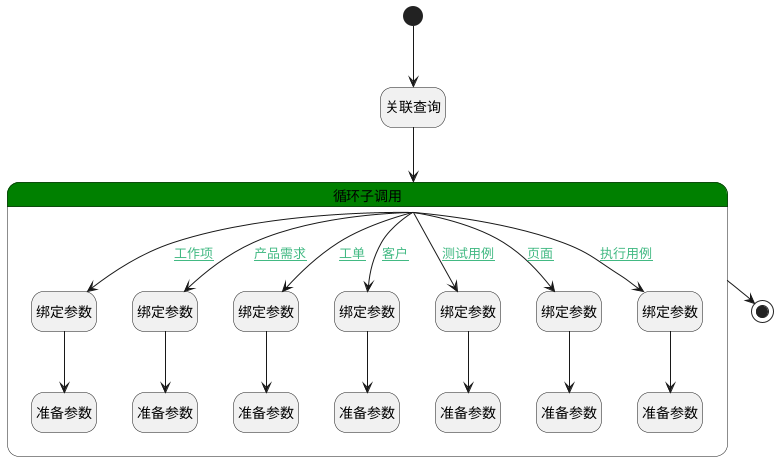

## 高级搜索 <!-- {docsify-ignore-all} -->

   高级搜索，用于填充所属相关信息字段

### 处理过程

### 处理步骤说明

#### 开始 :id=Begin [开始]

*- N/A*
#### 绑定参数 :id=BINDPARAM1 [绑定参数]

绑定参数`for_temp_obj(循环临时变量)` 到 `work_item(工作项)`
#### 准备参数 :id=PREPAREPARAM1 [准备参数]

1. 将`work_item(工作项).SHOW_IDENTIFIER(编号)` 设置给  `for_temp_obj(循环临时变量).PRINCIPAL_IDENTIFIER(评论主体编号)`
2. 将`work_item(工作项).PROJECT_ID(项目)` 设置给  `for_temp_obj(循环临时变量).PRINCIPAL_PARENT_ID(评论主体父标识)`
3. 将`work_item(工作项).PROJECT_NAME(所属项目)` 设置给  `for_temp_obj(循环临时变量).PRINCIPAL_PARENT_NAME(评论主体父名称)`
4. 将`work_item(工作项).TITLE(标题)` 设置给  `for_temp_obj(循环临时变量).PRINCIPAL_TITLE(评论主体标题)`

#### 关联查询 :id=DEDATASET1 [实体数据集]

调用实体 [评论搜索(SEARCH_COMMENT)](module/Base/search_comment.md) 数据集合 [关联查询(relation)](module/Base/search_comment#数据集合) ，查询参数为`Default(传入变量)`

将执行结果返回给参数`result_page(分页查询结果变量)`

#### 绑定参数 :id=BINDPARAM2 [绑定参数]

绑定参数`for_temp_obj(循环临时变量)` 到 `idea(产品需求)`
#### 准备参数 :id=PREPAREPARAM2 [准备参数]

1. 将`idea(产品需求).SHOW_IDENTIFIER(编号)` 设置给  `for_temp_obj(循环临时变量).PRINCIPAL_IDENTIFIER(评论主体编号)`
2. 将`idea(产品需求).PRODUCT_ID(产品)` 设置给  `for_temp_obj(循环临时变量).PRINCIPAL_PARENT_ID(评论主体父标识)`
3. 将`idea(产品需求).PRODUCT_NAME(所属产品)` 设置给  `for_temp_obj(循环临时变量).PRINCIPAL_PARENT_NAME(评论主体父名称)`
4. 将`idea(产品需求).TITLE(标题)` 设置给  `for_temp_obj(循环临时变量).PRINCIPAL_TITLE(评论主体标题)`

#### 循环子调用 :id=LOOPSUBCALL1 [循环子调用]

循环参数`result_page(分页查询结果变量)`，子循环参数使用`for_temp_obj(循环临时变量)`
#### 绑定参数 :id=BINDPARAM3 [绑定参数]

绑定参数`for_temp_obj(循环临时变量)` 到 `ticket(工单)`
#### 准备参数 :id=PREPAREPARAM3 [准备参数]

1. 将`ticket(工单).TITLE(标题)` 设置给  `for_temp_obj(循环临时变量).PRINCIPAL_TITLE(评论主体标题)`
2. 将`ticket(工单).PRODUCT_ID(产品标识)` 设置给  `for_temp_obj(循环临时变量).PRINCIPAL_PARENT_ID(评论主体父标识)`
3. 将`ticket(工单).PRODUCT_NAME(所属产品)` 设置给  `for_temp_obj(循环临时变量).PRINCIPAL_PARENT_NAME(评论主体父名称)`
4. 将`ticket(工单).SHOW_IDENTIFIER(编号)` 设置给  `for_temp_obj(循环临时变量).PRINCIPAL_IDENTIFIER(评论主体编号)`

#### 绑定参数 :id=BINDPARAM4 [绑定参数]

绑定参数`for_temp_obj(循环临时变量)` 到 `customer(客户)`
#### 准备参数 :id=PREPAREPARAM4 [准备参数]

1. 将`customer(客户).NAME(客户名称)` 设置给  `for_temp_obj(循环临时变量).PRINCIPAL_TITLE(评论主体标题)`
2. 将`customer(客户).PRODUCT_ID(产品标识)` 设置给  `for_temp_obj(循环临时变量).PRINCIPAL_PARENT_ID(评论主体父标识)`
3. 将`customer(客户).PRODUCT_NAME(产品名称)` 设置给  `for_temp_obj(循环临时变量).PRINCIPAL_PARENT_NAME(评论主体父名称)`

#### 绑定参数 :id=BINDPARAM5 [绑定参数]

绑定参数`for_temp_obj(循环临时变量)` 到 `test_case(测试用例)`
#### 准备参数 :id=PREPAREPARAM5 [准备参数]

1. 将`test_case(测试用例).SHOW_IDENTIFIER(编号)` 设置给  `for_temp_obj(循环临时变量).PRINCIPAL_IDENTIFIER(评论主体编号)`
2. 将`test_case(测试用例).TEST_LIBRARY_ID(测试库)` 设置给  `for_temp_obj(循环临时变量).PRINCIPAL_PARENT_ID(评论主体父标识)`
3. 将`test_case(测试用例).TITLE(标题)` 设置给  `for_temp_obj(循环临时变量).PRINCIPAL_TITLE(评论主体标题)`
4. 将`test_case(测试用例).TEST_LIBRARY_NAME(所属测试库)` 设置给  `for_temp_obj(循环临时变量).PRINCIPAL_PARENT_NAME(评论主体父名称)`

#### 结束 :id=END1 [结束]

返回 `result_page(分页查询结果变量)`

#### 绑定参数 :id=BINDPARAM6 [绑定参数]

绑定参数`for_temp_obj(循环临时变量)` 到 `page(页面)`
#### 准备参数 :id=PREPAREPARAM6 [准备参数]

1. 将`page(页面).NAME(主题)` 设置给  `for_temp_obj(循环临时变量).PRINCIPAL_TITLE(评论主体标题)`
2. 将`page(页面).SPACE_ID(空间标识)` 设置给  `for_temp_obj(循环临时变量).PRINCIPAL_PARENT_ID(评论主体父标识)`
3. 将`page(页面).SPACE_NAME(空间名称)` 设置给  `for_temp_obj(循环临时变量).PRINCIPAL_PARENT_NAME(评论主体父名称)`
4. 将`page(页面).SHOW_IDENTIFIER(编号)` 设置给  `for_temp_obj(循环临时变量).PRINCIPAL_IDENTIFIER(评论主体编号)`

#### 绑定参数 :id=BINDPARAM7 [绑定参数]

绑定参数`for_temp_obj(循环临时变量)` 到 `run(执行用例)`
#### 准备参数 :id=PREPAREPARAM7 [准备参数]

1. 将`run(执行用例).TITLE(标题)` 设置给  `for_temp_obj(循环临时变量).PRINCIPAL_TITLE(评论主体标题)`
2. 将`run(执行用例).LIBRARY_ID(测试库标识)` 设置给  `for_temp_obj(循环临时变量).PRINCIPAL_PARENT_ID(评论主体父标识)`
3. 将`run(执行用例).LIBRARY_NAME(所属测试库)` 设置给  `for_temp_obj(循环临时变量).PRINCIPAL_PARENT_NAME(评论主体父名称)`
4. 将`run(执行用例).IDENTIFIER(编号)` 设置给  `for_temp_obj(循环临时变量).PRINCIPAL_IDENTIFIER(评论主体编号)`
5. 将`run(执行用例).CASE_ID(测试用例标识)` 设置给  `for_temp_obj(循环临时变量).CASE_ID`

### 连接条件说明
#### 工作项 :id=LOOPSUBCALL1-BINDPARAM1

`for_temp_obj(循环临时变量).PRINCIPAL_TYPE(评论主体类型)` EQ `WORK_ITEM`
#### 产品需求 :id=LOOPSUBCALL1-BINDPARAM2

`for_temp_obj(循环临时变量).PRINCIPAL_TYPE(评论主体类型)` EQ `IDEA`
#### 工单 :id=LOOPSUBCALL1-BINDPARAM3

`for_temp_obj(循环临时变量).PRINCIPAL_TYPE(评论主体类型)` EQ `TICKET`
#### 客户 :id=LOOPSUBCALL1-BINDPARAM4

`for_temp_obj(循环临时变量).PRINCIPAL_TYPE(评论主体类型)` EQ `CUSTOMER`
#### 测试用例 :id=LOOPSUBCALL1-BINDPARAM5

`for_temp_obj(循环临时变量).PRINCIPAL_TYPE(评论主体类型)` EQ `TEST_CASE`
#### 页面 :id=LOOPSUBCALL1-BINDPARAM6

`for_temp_obj(循环临时变量).PRINCIPAL_TYPE(评论主体类型)` EQ `PAGE`
#### 执行用例 :id=LOOPSUBCALL1-BINDPARAM7

`Default(传入变量).PRINCIPAL_TYPE(评论主体类型)` EQ `RUN`

### 实体逻辑参数

|    中文名   |    代码名    |  数据类型    |  实体   |备注 |
| --------| --------| -------- | -------- | --------   |
|传入变量(<i class="fa fa-check"/></i>)|Default|过滤器|||
|客户|customer|数据对象|[客户(CUSTOMER)](module/ProdMgmt/customer.md)||
|循环临时变量|for_temp_obj|数据对象|[评论搜索(SEARCH_COMMENT)](module/Base/search_comment.md)||
|产品需求|idea|数据对象|[需求(IDEA)](module/ProdMgmt/idea.md)||
|页面|page|数据对象|[页面(PAGE)](module/Wiki/article_page.md)||
|分页查询结果变量|result_page|分页查询|||
|执行用例|run|数据对象|[执行用例(RUN)](module/TestMgmt/run.md)||
|测试用例|test_case|数据对象|[用例(TEST_CASE)](module/TestMgmt/test_case.md)||
|工单|ticket|数据对象|[工单(TICKET)](module/ProdMgmt/ticket.md)||
|工作项|work_item|数据对象|[工作项(WORK_ITEM)](module/ProjMgmt/work_item.md)||
