## 打开所属主页视图 <!-- {docsify-ignore-all} -->

   链接跳转项目/产品/测试库/空间首页视图

### 处理过程

```plantuml
@startuml
hide footbox
<style>
root {
  HyperlinkColor #42b983
}
</style>

hide empty description
state "开始" as Begin <<start>> [[$./open_parent_index_view#begin {开始}]]
state "打开测试库主视图" as DEUIACTION3  [[$./open_parent_index_view#deuiaction3 {打开测试库主视图}]]
state "打开项目主视图" as DEUIACTION1  [[$./open_parent_index_view#deuiaction1 {打开项目主视图}]]
state "打开空间主视图" as DEUIACTION4  [[$./open_parent_index_view#deuiaction4 {打开空间主视图}]]
state "打开产品主视图" as DEUIACTION2  [[$./open_parent_index_view#deuiaction2 {打开产品主视图}]]


Begin --> DEUIACTION1 : [[$./open_parent_index_view#begin-deuiaction1{项目-工作项} 项目-工作项]]
Begin --> DEUIACTION2 : [[$./open_parent_index_view#begin-deuiaction2{产品-需求/工单/客户} 产品-需求/工单/客户]]
Begin --> DEUIACTION3 : [[$./open_parent_index_view#begin-deuiaction3{测试库-测试用例/执行用例} 测试库-测试用例/执行用例]]
Begin --> DEUIACTION4 : [[$./open_parent_index_view#begin-deuiaction4{空间-页面} 空间-页面]]


@enduml
```




### 处理步骤说明

#### 开始 :id=Begin<sup class="footnote-symbol"> <font color=gray size=1>[开始]</font></sup>


#### 打开项目主视图 :id=DEUIACTION1<sup class="footnote-symbol"> <font color=gray size=1>[实体界面行为调用]</font></sup>


调用实体 [评论搜索(SEARCH_COMMENT)](module/Base/search_comment.md) 界面行为 [打开项目主视图](module/Base/search_comment#界面行为) ，行为参数为`Default(传入变量)`

#### 打开测试库主视图 :id=DEUIACTION3<sup class="footnote-symbol"> <font color=gray size=1>[实体界面行为调用]</font></sup>


调用实体 [评论搜索(SEARCH_COMMENT)](module/Base/search_comment.md) 界面行为 [打开测试库主视图](module/Base/search_comment#界面行为) ，行为参数为`Default(传入变量)`

#### 打开空间主视图 :id=DEUIACTION4<sup class="footnote-symbol"> <font color=gray size=1>[实体界面行为调用]</font></sup>


调用实体 [评论搜索(SEARCH_COMMENT)](module/Base/search_comment.md) 界面行为 [打开空间主视图](module/Base/search_comment#界面行为) ，行为参数为`Default(传入变量)`

#### 打开产品主视图 :id=DEUIACTION2<sup class="footnote-symbol"> <font color=gray size=1>[实体界面行为调用]</font></sup>


调用实体 [评论搜索(SEARCH_COMMENT)](module/Base/search_comment.md) 界面行为 [打开产品主视图](module/Base/search_comment#界面行为) ，行为参数为`Default(传入变量)`

### 连接条件说明
#### 项目-工作项 :id=Begin-DEUIACTION1

```Default(传入变量).principal_type``` EQ ```WORK_ITEM```
#### 产品-需求/工单/客户 :id=Begin-DEUIACTION2

(```Default(传入变量).principal_type``` EQ ```CUSTOMER``` OR ```Default(传入变量).principal_type``` EQ ```IDEA``` OR ```Default(传入变量).principal_type``` EQ ```TICKET```)
#### 测试库-测试用例/执行用例 :id=Begin-DEUIACTION3

(```Default(传入变量).principal_type``` EQ ```TEST_CASE``` OR ```Default(传入变量).principal_type``` EQ ```RUN```)
#### 空间-页面 :id=Begin-DEUIACTION4

```Default(传入变量).principal_type``` EQ ```PAGE```


### 实体逻辑参数

|    中文名   |    代码名    |  数据类型      |备注 |
| --------| --------| --------  | --------   |
|传入变量(<i class="fa fa-check"/></i>)|Default|数据对象||
