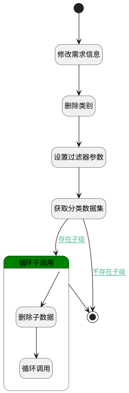

## 删除分组及其下类别 <!-- {docsify-ignore-all} -->

   删除分组及其下子类别（测试）

### 处理过程




### 处理步骤说明

#### 开始 :id=Begin<sup class="footnote-symbol"> <font color=gray size=1>[开始]</font></sup>


*- N/A*
#### 修改需求信息 :id=RAWSQLCALL1<sup class="footnote-symbol"> <font color=gray size=1>[直接SQL调用]</font></sup>


<p class="panel-title"><b>执行sql语句</b></p>

```sql
UPDATE idea t 
INNER JOIN category t21 ON t.category_id = t21.ID 
INNER JOIN section t31 on t21.SECTION_ID = t31.id
SET t.category_id = NULL
WHERE (t21.SECTION_ID = ? )
```

<p class="panel-title"><b>执行sql参数</b></p>

1. `Default(传入变量).ID(标识)`


#### 删除类别 :id=DEACTION2<sup class="footnote-symbol"> <font color=gray size=1>[实体行为]</font></sup>


调用实体 [分组(SECTION)](module/Base/section.md) 行为 [Remove](module/Base/section#行为) ，行为参数为`Default(传入变量)`

#### 设置过滤器参数 :id=PREPAREPARAM1<sup class="footnote-symbol"> <font color=gray size=1>[准备参数]</font></sup>


1. 将`Default(传入变量).ID(标识)` 设置给  `category_filter(模块过滤器).N_SECTION_ID_EQ`

#### 获取分类数据集 :id=DEDATASET1<sup class="footnote-symbol"> <font color=gray size=1>[实体数据集]</font></sup>


调用实体 [类别(CATEGORY)](module/Base/category.md) 数据集合 [数据集(DEFAULT)](module/Base/category#数据集合) ，查询参数为`category_filter(模块过滤器)`

将执行结果返回给参数`category_page(类别分页查询结果)`

#### 循环子调用 :id=LOOPSUBCALL1<sup class="footnote-symbol"> <font color=gray size=1>[循环子调用]</font></sup>


循环参数`category_page(类别分页查询结果)`，子循环参数使用`for_temp_obj(循环临时变量)`
#### 删除子数据 :id=DEACTION1<sup class="footnote-symbol"> <font color=gray size=1>[实体行为]</font></sup>


调用实体 [类别(CATEGORY)](module/Base/category.md) 行为 [Remove](module/Base/category#行为) ，行为参数为`for_temp_obj(循环临时变量)`

#### 循环调用 :id=DELOGIC1<sup class="footnote-symbol"> <font color=gray size=1>[实体逻辑]</font></sup>


调用实体 [分组(SECTION)](module/Base/section.md) 处理逻辑 [删除分组及其下类别]((module/Base/section/logic/delete_section.md)) ，行为参数为`for_temp_obj(循环临时变量)`

#### 结束 :id=END1<sup class="footnote-symbol"> <font color=gray size=1>[结束]</font></sup>


*- N/A*


### 连接条件说明
#### 不存在子级 :id=DEDATASET1-END1

`category_page(类别分页查询结果).size` EQ `0`
#### 存在子级 :id=DEDATASET1-LOOPSUBCALL1

`category_page(类别分页查询结果).size` GT `0`


### 实体逻辑参数

|    中文名   |    代码名    |  数据类型    |  实体   |备注 |
| --------| --------| -------- | -------- | --------   |
|传入变量(<i class="fa fa-check"/></i>)|Default|数据对象|[分组(SECTION)](module/Base/section.md)||
|模块过滤器|category_filter|过滤器|||
|类别分页查询结果|category_page|分页查询|||
|过滤器|filter|过滤器|||
|循环临时变量|for_temp_obj|数据对象|[类别(CATEGORY)](module/Base/category.md)||
