## 新建分组排序 <!-- {docsify-ignore-all} -->

   

### 处理过程

```plantuml
@startuml
hide empty description
<style>
root {
  HyperlinkColor #42b983
}
</style>

hide empty description
state "开始" as Begin <<start>> [[$./sort#begin {"开始"}]]
state "准备参数" as PREPAREPARAM1  [[$./sort#prepareparam1 {"准备参数"}]]
state "实体数据集" as DEDATASET1  [[$./sort#dedataset1 {"实体数据集"}]]
state "执行脚本代码" as RAWSFCODE1  [[$./sort#rawsfcode1 {"执行脚本代码"}]]
state "结束" as END1 <<end>> [[$./sort#end1 {"结束"}]]


Begin --> PREPAREPARAM1
PREPAREPARAM1 --> DEDATASET1
DEDATASET1 --> RAWSFCODE1 : [[$./sort#dedataset1-rawsfcode1{连接名称} 连接名称]]
RAWSFCODE1 --> END1


@enduml
```




### 处理步骤说明

#### 开始 :id=Begin<sup class="footnote-symbol"> <font color=gray size=1>[开始]</font></sup>


*- N/A*
#### 准备参数 :id=PREPAREPARAM1<sup class="footnote-symbol"> <font color=gray size=1>[准备参数]</font></sup>


1. 将`Default(传入变量).OWNER_TYPE(所属数据对象)` 设置给  `filter.N_OWNER_TYPE_EQ`
2. 将`sequence,desc` 设置给  `filter.sort`
3. 将`Default(传入变量).OWNER_SUBTYPE(所属对象子类型)` 设置给  `filter.N_OWNER_SUBTYPE_EQ`
4. 将`Default(传入变量).OWNER_ID(所属数据标识)` 设置给  `filter.N_OWNER_ID_EQ`

#### 实体数据集 :id=DEDATASET1<sup class="footnote-symbol"> <font color=gray size=1>[实体数据集]</font></sup>


调用实体 [分组(SECTION)](module/Base/section.md) 数据集合 [数据集(DEFAULT)](module/Base/section#数据集合) ，查询参数为`filter`

将执行结果返回给参数`page`

#### 执行脚本代码 :id=RAWSFCODE1<sup class="footnote-symbol"> <font color=gray size=1>[直接后台代码]</font></sup>


<p class="panel-title"><b>执行代码[Groovy]</b></p>

```groovy
def _default = logic.param('Default').getReal()
def page = logic.param('page').getReal()

def maxValue = 0
if (page[0] != null) {
    maxValue = page[0].get('sequence')
    _default.set('sequence', maxValue + 10)
}
```

#### 结束 :id=END1<sup class="footnote-symbol"> <font color=gray size=1>[结束]</font></sup>


返回 `Default(传入变量)`


### 连接条件说明
#### 连接名称 :id=DEDATASET1-RAWSFCODE1

`page(page).size` GT `0`


### 实体逻辑参数

|    中文名   |    代码名    |  数据类型    |  实体   |备注 |
| --------| --------| -------- | -------- | --------   |
|传入变量(<i class="fa fa-check"/></i>)|Default|数据对象|[分组(SECTION)](module/Base/section.md)||
|filter|filter|过滤器|||
|page|page|分页查询|||
