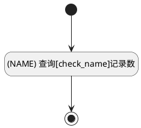

## 名称(NAME) <!-- {docsify-ignore-all} -->

   

### 名称重复判断 :id=CHECK_NAME

#### 条件说明

##### (NAME) 查询[check_name]记录数 :id=acb6f815295421e118fac05ce3d5b6855

*关键条件*

查询[检查名称是否重复(check_name)]()结果`result` 在区间 `(-∞ , 1)` 内

> [!ATTENTION|label:规则信息|icon:fa fa-warning]
> 名称已存在

### 默认规则 :id=Default

```plantuml
@startuml
hide empty description
<style>
root {
  HyperlinkColor #42b983
}
</style>

state "start" as start  <<start>>
state "end" as end <<end>>
state "默认字符串长度" as 119ab839c6170bec58e2f51ba10f06ad [[$./name#a119ab839c6170bec58e2f51ba10f06ad {"默认字符串长度"}]]


start --> 119ab839c6170bec58e2f51ba10f06ad 
119ab839c6170bec58e2f51ba10f06ad --> end 


@enduml
```

#### 条件说明

##### 默认字符串长度 :id=a56b20dbf1ee0c8730c6861a8e6eafa73

*关键条件*

`NAME(名称)` 属性长度在区间 `(0 , 200]` 内

> [!ATTENTION|label:规则信息|icon:fa fa-warning]
> 内容长度必须小于等于[200]

