## 保存模板 <!-- {docsify-ignore-all} -->

   

### 处理过程

```plantuml
@startuml
hide empty description
<style>
root {
  HyperlinkColor #42b983
}
</style>

hide empty description
state "开始" as Begin <<start>> [[$./save_template#begin {"开始"}]]
state "结束" as END1 <<end>> [[$./save_template#end1 {"结束"}]]
state "执行脚本代码" as RAWSFCODE1  [[$./save_template#rawsfcode1 {"执行脚本代码"}]]
state "实体行为" as DEACTION1  [[$./save_template#deaction1 {"实体行为"}]]


Begin --> RAWSFCODE1
RAWSFCODE1 --> DEACTION1
DEACTION1 --> END1


@enduml
```




### 处理步骤说明

#### 开始 :id=Begin<sup class="footnote-symbol"> <font color=gray size=1>[开始]</font></sup>


*- N/A*
#### 结束 :id=END1<sup class="footnote-symbol"> <font color=gray size=1>[结束]</font></sup>


*- N/A*

#### 执行脚本代码 :id=RAWSFCODE1<sup class="footnote-symbol"> <font color=gray size=1>[直接后台代码]</font></sup>


<p class="panel-title"><b>执行代码[Groovy]</b></p>

```groovy
def _default = logic.param('Default').getReal() 
def user = sys.user()

if (_default.get('visibility') == '10') {
    _default.set('owner_id', user.getUserid())
}
if (_default.get('visibility') == '30') {
    _default.set('owner_id', user.getOrgid())
}
```

#### 实体行为 :id=DEACTION1<sup class="footnote-symbol"> <font color=gray size=1>[实体行为]</font></sup>


调用实体 [通用模板(TEMPLATE)](module/Base/template.md) 行为 [Save](module/Base/template#行为) ，行为参数为`Default(传入变量)`


### 实体逻辑参数

|    中文名   |    代码名    |  数据类型    |  实体   |备注 |
| --------| --------| -------- | -------- | --------   |
|传入变量(<i class="fa fa-check"/></i>)|Default|数据对象|[通用模板(TEMPLATE)](module/Base/template.md)||
