## 自动将新成员加入指定空间 <!-- {docsify-ignore-all} -->

   新成员加入团队后，自动加入到指定的空间。

### 处理过程

```plantuml
@startuml
hide empty description
<style>
root {
  HyperlinkColor #42b983
}
</style>

hide empty description
state "开始" as Begin <<start>> [[$./auto_add_member_to_space#begin {"开始"}]]
state "设置空间成员" as PREPAREPARAM1  [[$./auto_add_member_to_space#prepareparam1 {"设置空间成员"}]]
state "添加空间成员" as DEACTION1  [[$./auto_add_member_to_space#deaction1 {"添加空间成员"}]]
state "结束" as END1 <<end>> [[$./auto_add_member_to_space#end1 {"结束"}]]


Begin --> PREPAREPARAM1
PREPAREPARAM1 --> DEACTION1
DEACTION1 --> END1


@enduml
```

### 处理步骤说明

#### 开始 :id=Begin [开始]

*- N/A*
#### 设置空间成员 :id=PREPAREPARAM1 [准备参数]

1. 将`Default(传入变量).USER_ID` 设置给  `space_member.USER_ID(登录名)`
2. 将`Default(传入变量).ROLE_ID` 设置给  `space_member.ROLE_ID(角色)`
3. 将`Default(传入变量).NAME(名称)` 设置给  `space_member.NAME(姓名)`
4. 将`plm_space` 设置给  `space_member.SPACE_ID(空间标识)`

#### 添加空间成员 :id=DEACTION1 [实体行为]

调用实体 [空间成员(SPACE_MEMBER)](module/Wiki/space_member.md) 行为 [Save](module/Wiki/space_member#行为) ，行为参数为`space_member`

#### 结束 :id=END1 [结束]

*- N/A*

### 实体逻辑参数

|    中文名   |    代码名    |  数据类型    |  实体   |备注 |
| --------| --------| -------- | -------- | --------   |
|传入变量(<i class="fa fa-check"/></i>)|Default|数据对象|[规则模板(TEMPLATE_FLOW)](module/Base/template_flow.md)||
|space_member|space_member|数据对象|[空间成员(SPACE_MEMBER)](module/Wiki/space_member.md)||
