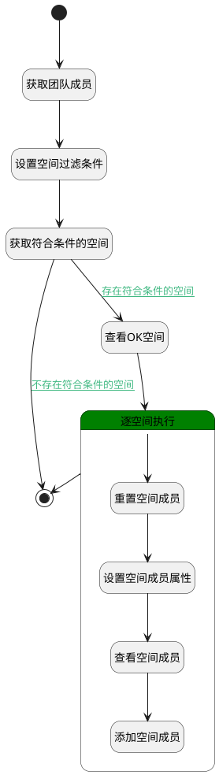

## 自动将新团队成员加入团队空间 <!-- {docsify-ignore-all} -->

   新成员加入团队后，自动加入到该团队的空间。

### 处理过程




### 处理步骤说明

#### 开始 :id=Begin<sup class="footnote-symbol"> <font color=gray size=1>[开始]</font></sup>


*- N/A*
#### 获取团队成员 :id=DEACTION2<sup class="footnote-symbol"> <font color=gray size=1>[实体行为]</font></sup>


调用实体 [成员(MEMBER)](module/Base/member.md) 行为 [Get](module/Base/member#行为) ，行为参数为`Default(传入变量)`

将执行结果返回给参数`Default(传入变量)`

#### 设置空间过滤条件 :id=PREPAREPARAM2<sup class="footnote-symbol"> <font color=gray size=1>[准备参数]</font></sup>


1. 将`Default(传入变量).owner_id` 设置给  `space_filter(空间筛选).n_scope_id_eq`
2. 将`1000` 设置给  `space_filter(空间筛选).size`

#### 获取符合条件的空间 :id=DEDATASET1<sup class="footnote-symbol"> <font color=gray size=1>[实体数据集]</font></sup>


调用实体 [空间(SPACE)](module/Wiki/space.md) 数据集合 [数据集(DEFAULT)](module/Wiki/space#数据集合) ，查询参数为`space_filter(空间筛选)`

将执行结果返回给参数`spaces(空间集合)`

#### 结束 :id=END2<sup class="footnote-symbol"> <font color=gray size=1>[结束]</font></sup>


*- N/A*

#### 查看OK空间 :id=DEBUGPARAM3<sup class="footnote-symbol"> <font color=gray size=1>[调试逻辑参数]</font></sup>


> [!NOTE|label:调试信息|icon:fa fa-bug]
> 调试输出参数`spaces(空间集合)`的详细信息


#### 逐空间执行 :id=LOOPSUBCALL1<sup class="footnote-symbol"> <font color=gray size=1>[循环子调用]</font></sup>


循环参数`spaces(空间集合)`，子循环参数使用`space_temp(循环空间)`
#### 重置空间成员 :id=RESETPARAM1<sup class="footnote-symbol"> <font color=gray size=1>[重置参数]</font></sup>


重置参数```space_member(space_member)```
#### 设置空间成员属性 :id=PREPAREPARAM1<sup class="footnote-symbol"> <font color=gray size=1>[准备参数]</font></sup>


1. 将`Default(传入变量).USER_ID` 设置给  `space_member.USER_ID(登录名)`
2. 将`Default(传入变量).ROLE_ID` 设置给  `space_member.ROLE_ID(角色)`
3. 将`Default(传入变量).NAME(名称)` 设置给  `space_member.NAME(姓名)`
4. 将`space_temp(循环空间).id(标识)` 设置给  `space_member.SPACE_ID(空间标识)`

#### 查看空间成员 :id=DEBUGPARAM2<sup class="footnote-symbol"> <font color=gray size=1>[调试逻辑参数]</font></sup>


> [!NOTE|label:调试信息|icon:fa fa-bug]
> 调试输出参数`space_member`的详细信息


#### 添加空间成员 :id=DEACTION1<sup class="footnote-symbol"> <font color=gray size=1>[实体行为]</font></sup>


调用实体 [空间成员(SPACE_MEMBER)](module/Wiki/space_member.md) 行为 [Save](module/Wiki/space_member#行为) ，行为参数为`space_member`


### 连接条件说明
#### 存在符合条件的空间 :id=DEDATASET1-DEBUGPARAM3

`spaces(空间集合).size` GT `0`
#### 不存在符合条件的空间 :id=DEDATASET1-END2

`spaces(空间集合).size` EQ `0`


### 实体逻辑参数

|    中文名   |    代码名    |  数据类型    |  实体   |备注 |
| --------| --------| -------- | -------- | --------   |
|传入变量(<i class="fa fa-check"/></i>)|Default|数据对象|[规则模板(TEMPLATE_FLOW)](module/Base/template_flow.md)||
|空间筛选|space_filter|过滤器|||
|space_member|space_member|数据对象|[空间成员(SPACE_MEMBER)](module/Wiki/space_member.md)||
|循环空间|space_temp|数据对象|[空间(SPACE)](module/Wiki/space.md)||
|空间集合|spaces|分页查询|||
