## 自动设置工作项负责人 <!-- {docsify-ignore-all} -->

   

### 处理过程

```plantuml
@startuml
hide empty description
<style>
root {
  HyperlinkColor #42b983
}
</style>

hide empty description
state "开始" as Begin <<start>> [[$./auto_fill_assign_man#begin {"开始"}]]
state "设置人员" as PREPAREPARAM1  [[$./auto_fill_assign_man#prepareparam1 {"设置人员"}]]
state "结束" as END1 <<end>> [[$./auto_fill_assign_man#end1 {"结束"}]]


Begin --> PREPAREPARAM1
PREPAREPARAM1 --> END1


@enduml
```

### 处理步骤说明

#### 开始 :id=Begin [开始]

*- N/A*
#### 设置人员 :id=PREPAREPARAM1 [准备参数]

1. 将`用户全局对象.srfpersonname` 设置给  `Default(传入变量).assignee_name`
2. 将`用户全局对象.srfpersonid` 设置给  `Default(传入变量).assignee_id`

#### 结束 :id=END1 [结束]

*- N/A*

### 实体逻辑参数

|    中文名   |    代码名    |  数据类型    |  实体   |备注 |
| --------| --------| -------- | -------- | --------   |
|传入变量(<i class="fa fa-check"/></i>)|Default|数据对象|[规则模板(TEMPLATE_FLOW)](module/Base/template_flow.md)||
