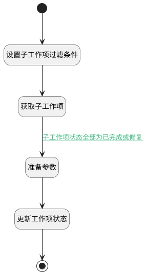

## 同步父子工作项的完成状态 <!-- {docsify-ignore-all} -->

   同步父子工作项的完成状态

### 处理过程

### 处理步骤说明

#### 开始 :id=BEGIN_01 [开始]

*- N/A*
#### 设置子工作项过滤条件 :id=PREPAREPARAM_02 [准备参数]

1. 将`30,40` 设置给  `filter(子工作项过滤器).n_state_notin`
2. 将`default(属性变更工作项).PID(父标识)` 设置给  `filter(子工作项过滤器).n_pid_eq`

#### 获取子工作项 :id=DEDATASET_01 [实体数据集]

调用实体 [工作项(WORK_ITEM)](module/ProjMgmt/work_item.md) 数据集合 [数据集(DEFAULT)](module/ProjMgmt/work_item#数据集合) ，查询参数为`filter(子工作项过滤器)`

将执行结果返回给参数`child_work_items(子工作项集合)`

#### 结束 :id=END_01 [结束]

*- N/A*

#### 准备参数 :id=PREPAREPARAM_03 [准备参数]

1. 将`default(属性变更工作项).PID(父标识)` 设置给  `parent_work_item(父工作项).ID(标识)`
2. 将`default(属性变更工作项).STATE(状态)` 设置给  `parent_work_item(父工作项).STATE(状态)`

#### 更新工作项状态 :id=DEACTION_02 [实体行为]

调用实体 [工作项(WORK_ITEM)](module/ProjMgmt/work_item.md) 行为 [Update](module/ProjMgmt/work_item#行为) ，行为参数为`parent_work_item(父工作项)`

### 连接条件说明
#### 子工作项状态全部为已完成或修复 :id=DEDATASET_01-PREPAREPARAM_03

`child_work_items(子工作项集合).total` EQ `0`

### 实体逻辑参数

|    中文名   |    代码名    |  数据类型    |  实体   |备注 |
| --------| --------| -------- | -------- | --------   |
|子工作项集合|child_work_items|分页查询|||
|属性变更工作项|default|数据对象|[工作项(WORK_ITEM)](module/ProjMgmt/work_item.md)||
|子工作项过滤器|filter|过滤器|||
|父工作项|parent_work_item|数据对象|[工作项(WORK_ITEM)](module/ProjMgmt/work_item.md)||
