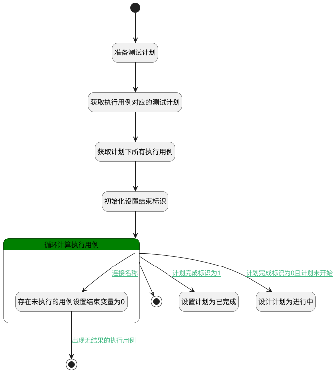

## 自动设置测试计划的启动和完成状态 <!-- {docsify-ignore-all} -->

   
自动设置测试计划的启动和完成状态

### 处理过程

### 处理步骤说明

#### 开始 :id=Begin [开始]

*- N/A*
#### 准备测试计划 :id=PREPAREPARAM1 [准备参数]

1. 将`Default(传入变量).PLAN_ID(测试计划标识)` 设置给  `test_plan(测试计划).ID(标识)`

#### 获取执行用例对应的测试计划 :id=DEACTION1 [实体行为]

调用实体 [测试计划(TEST_PLAN)](module/TestMgmt/test_plan.md) 行为 [Get](module/TestMgmt/test_plan#行为) ，行为参数为`test_plan(测试计划)`

将执行结果返回给参数`test_plan(测试计划)`

#### 获取计划下所有执行用例 :id=DEDATASET1 [实体数据集]

调用实体 [执行用例(RUN)](module/TestMgmt/run.md) 数据集合 [当前模块下用例(normal)](module/TestMgmt/run#数据集合) ，查询参数为`runfilter(执行用例过滤器)`

将执行结果返回给参数`runs(计划下所有执行用例)`

#### 初始化设置结束标识 :id=PREPAREPARAM3 [准备参数]

1. 将`1` 设置给  `finish_flag(全部完成标识)`

#### 循环计算执行用例 :id=LOOPSUBCALL1 [循环子调用]

循环参数`runs(计划下所有执行用例)`，子循环参数使用`temp_run(执行用例（循环使用）)`
#### 结束 :id=END2 [结束]

*- N/A*

#### 存在未执行的用例设置结束变量为0 :id=PREPAREPARAM2 [准备参数]

1. 将`0` 设置给  `finish_flag(全部完成标识)`

#### 设置计划为已完成 :id=PREPAREPARAM4 [准备参数]

    无

#### 设计计划为进行中 :id=PREPAREPARAM5 [准备参数]

    无

#### 结束 :id=END1 [结束]

返回 `跳出循环（BREAK）`

### 连接条件说明
#### 连接名称 :id=LOOPSUBCALL1-PREPAREPARAM2

`temp_run(执行用例（循环使用）).STATUS(执行结果)` ISNULL
#### 出现无结果的执行用例 :id=PREPAREPARAM2-END1

`finish_flag(全部完成标识)` EQ `0`
#### 计划完成标识为1 :id=LOOPSUBCALL1-PREPAREPARAM4

`finish_flag(全部完成标识)` EQ `1`
#### 计划完成标识为0且计划未开始 :id=LOOPSUBCALL1-PREPAREPARAM5

`finish_flag(全部完成标识)` EQ `0` AND `test_plan(测试计划).STATUS(状态)` EQ `pending`

### 实体逻辑参数

|    中文名   |    代码名    |  数据类型    |  实体   |备注 |
| --------| --------| -------- | -------- | --------   |
|传入变量(<i class="fa fa-check"/></i>)|Default|数据对象|[执行用例(RUN)](module/TestMgmt/run.md)||
|全部完成标识|finish_flag|简单数据|||
|执行用例过滤器|runfilter|过滤器|||
|计划下所有执行用例|runs|分页查询|||
|执行用例（循环使用）|temp_run|数据对象|[执行用例(RUN)](module/TestMgmt/run.md)||
|测试计划|test_plan|数据对象|[测试计划(TEST_PLAN)](module/TestMgmt/test_plan.md)||
