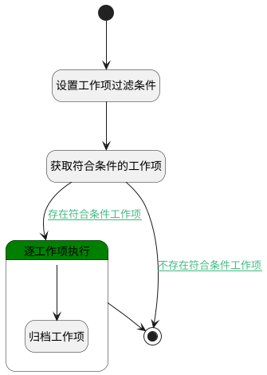

## 定时将已完成工作项归档 <!-- {docsify-ignore-all} -->

   通过定时任务，将已完成的工作项归档，结束时间超过三天。

### 处理过程

### 处理步骤说明

#### 开始 :id=Begin [开始]

*- N/A*
#### 设置工作项过滤条件 :id=PREPAREPARAM1 [准备参数]

1. 将`scrum_task` 设置给  `work_item_filter(工作项筛选).n_work_item_type_id_eq`
2. 将`0` 设置给  `work_item_filter(工作项筛选).IS_ARCHIVED(是否已归档)`
3. 将`0` 设置给  `work_item_filter(工作项筛选).IS_DELETED(是否已删除)`
4. 将`3` 设置给  `work_item_filter(工作项筛选).f_end_at_datediffnow_gtandeq`
5. 将`40` 设置给  `work_item_filter(工作项筛选).n_state_eq`
6. 将`1000` 设置给  `work_item_filter(工作项筛选).size`

#### 获取符合条件的工作项 :id=DEDATASET1 [实体数据集]

调用实体 [工作项(WORK_ITEM)](module/ProjMgmt/work_item.md) 数据集合 [数据集(DEFAULT)](module/ProjMgmt/work_item#数据集合) ，查询参数为`work_item_filter(工作项筛选)`

将执行结果返回给参数`work_items(工作项集合)`

#### 结束 :id=END2 [结束]

*- N/A*

#### 逐工作项执行 :id=LOOPSUBCALL1 [循环子调用]

循环参数`work_items(工作项集合)`，子循环参数使用`work_item_temp(循环工作项)`
#### 归档工作项 :id=DEACTION1 [实体行为]

调用实体 [工作项(WORK_ITEM)](module/ProjMgmt/work_item.md) 行为 [归档(archive)](module/ProjMgmt/work_item#行为) ，行为参数为`work_item_temp(循环工作项)`

### 连接条件说明
#### 存在符合条件工作项 :id=DEDATASET1-LOOPSUBCALL1

`work_items(工作项集合).size` GT `0`
#### 不存在符合条件工作项 :id=DEDATASET1-END2

`work_items(工作项集合).size` EQ `0`

### 实体逻辑参数

|    中文名   |    代码名    |  数据类型    |  实体   |备注 |
| --------| --------| -------- | -------- | --------   |
|传入变量(<i class="fa fa-check"/></i>)|Default|数据对象|[规则模板(TEMPLATE_FLOW)](module/Base/template_flow.md)||
|工作项筛选|work_item_filter|过滤器|||
|循环工作项|work_item_temp|数据对象|[工作项(WORK_ITEM)](module/ProjMgmt/work_item.md)||
|工作项集合|work_items|分页查询|||
