## 取消统计 <!-- {docsify-ignore-all} -->

   取消用户统计状态

### 处理过程

```plantuml
@startuml
hide empty description
<style>
root {
  HyperlinkColor #42b983
}
</style>

hide empty description
state "开始" as Begin <<start>> [[$./cancel_report_flag#begin {"开始"}]]
state "获取用户全量信息" as DEACTION2  [[$./cancel_report_flag#deaction2 {"获取用户全量信息"}]]
state "设置用户参数" as PREPAREPARAM1  [[$./cancel_report_flag#prepareparam1 {"设置用户参数"}]]
state "取消用户统计状态" as DEACTION1  [[$./cancel_report_flag#deaction1 {"取消用户统计状态"}]]
state "结束" as END1 <<end>> [[$./cancel_report_flag#end1 {"结束"}]]


Begin --> DEACTION2
DEACTION2 --> PREPAREPARAM1
PREPAREPARAM1 --> DEACTION1
DEACTION1 --> END1


@enduml
```

### 处理步骤说明

#### 开始 :id=Begin [开始]

*- N/A*
#### 获取用户全量信息 :id=DEACTION2 [实体行为]

调用实体 [企业用户(USER)](module/Base/user.md) 行为 [获取人员全量信息(GetFull)](module/Base/user#行为) ，行为参数为`Default(传入变量)`

将执行结果返回给参数`Default(传入变量)`

#### 设置用户参数 :id=PREPAREPARAM1 [准备参数]

1. 将`0` 设置给  `Default(传入变量).REPORT_FLAG(统计)`

#### 取消用户统计状态 :id=DEACTION1 [实体行为]

调用实体 [企业用户(USER)](module/Base/user.md) 行为 [Update](module/Base/user#行为) ，行为参数为`Default(传入变量)`

#### 结束 :id=END1 [结束]

*- N/A*

### 实体逻辑参数

|    中文名   |    代码名    |  数据类型    |  实体   |备注 |
| --------| --------| -------- | -------- | --------   |
|传入变量(<i class="fa fa-check"/></i>)|Default|数据对象|[企业用户(USER)](module/Base/user.md)||
