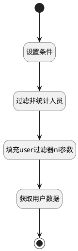

## 统计过滤 <!-- {docsify-ignore-all} -->

   排除非统计用户

### 处理过程




### 处理步骤说明

#### 开始 :id=Begin<sup class="footnote-symbol"> <font color=gray size=1>[开始]</font></sup>


*- N/A*
#### 设置条件 :id=PREPAREPARAM1<sup class="footnote-symbol"> <font color=gray size=1>[准备参数]</font></sup>


1. 将`REPORT_FLAG` 设置给  `storage_filter(动态存储过滤器).n_name_eq`
2. 将`1000` 设置给  `storage_filter(动态存储过滤器).size`
3. 将`0` 设置给  `storage_filter(动态存储过滤器).n_int_value_eq`

#### 过滤非统计人员 :id=DEDATASET1<sup class="footnote-symbol"> <font color=gray size=1>[实体数据集]</font></sup>


调用实体 [扩展存储(EXTEND_STORAGE)](module/Base/extend_storage.md) 数据集合 [数据集(DEFAULT)](module/Base/extend_storage#数据集合) ，查询参数为`storage_filter(动态存储过滤器)`

将执行结果返回给参数`storage_page(动态存储集合)`

#### 填充user过滤器ni参数 :id=RAWSFCODE1<sup class="footnote-symbol"> <font color=gray size=1>[直接后台代码]</font></sup>


<p class="panel-title"><b>执行代码[JavaScript]</b></p>

```javascript
var storage_page = logic.getParam("storage_page");
var user_filter = logic.getParam("Default");
var user_ids = "";
 for (var i = 0; i < storage_page.length; i++) {
     if(i>0){
         user_ids = user_ids+",";
     }
     var _storage = storage_page.get(i);
     user_ids = user_ids + _storage.get("owner_id");
 }
if(user_ids != ""){
    user_filter.ni("id",user_ids);
}
```

#### 获取用户数据 :id=DEDATASET2<sup class="footnote-symbol"> <font color=gray size=1>[实体数据集]</font></sup>


调用实体 [企业用户(USER)](module/Base/user.md) 数据集合 [数据集(DEFAULT)](module/Base/user#数据集合) ，查询参数为`Default(传入变量)`

将执行结果返回给参数`user_page(用户结果)`

#### 结束 :id=END1<sup class="footnote-symbol"> <font color=gray size=1>[结束]</font></sup>


返回 `user_page(用户结果)`


### 实体逻辑参数

|    中文名   |    代码名    |  数据类型    |  实体   |备注 |
| --------| --------| -------- | -------- | --------   |
|传入变量(<i class="fa fa-check"/></i>)|Default|过滤器|||
|动态存储过滤器|storage_filter|过滤器|||
|动态存储集合|storage_page|分页查询|||
|用户过滤器|user_filter|过滤器|||
|用户结果|user_page|分页查询|||
