## 修改密码（表单） <!-- {docsify-ignore-all} -->

   修改密码

### 处理过程

```plantuml
@startuml
hide footbox
<style>
root {
  HyperlinkColor #42b983
}
</style>

hide empty description
state "开始" as Begin <<start>> [[$./change_pas#begin {开始}]]
state "校验表单" as RAWJSCODE1  [[$./change_pas#rawjscode1 {校验表单}]]
state "结束" as END1 <<end>> [[$./change_pas#end1 {结束}]]


Begin --> RAWJSCODE1
RAWJSCODE1 --> END1


@enduml
```




### 处理步骤说明

#### 开始 :id=Begin<sup class="footnote-symbol"> <font color=gray size=1>[开始]</font></sup>


#### 结束 :id=END1<sup class="footnote-symbol"> <font color=gray size=1>[结束]</font></sup>


#### 校验表单 :id=RAWJSCODE1<sup class="footnote-symbol"> <font color=gray size=1>[直接前台代码]</font></sup>


<p class="panel-title"><b>执行代码</b></p>

```javascript
(async function() { 
const bol = await uiLogic.form.validate();
if (bol) {
    const {old_password,new_password,sure_password} = uiLogic.default;
    const result = await ibiz.appUtil.changePwd(old_password,new_password,{surePwd: sure_password})
    if (result && result.ok) {
      ibiz.message.success('修改密码成功');
    } else {
      ibiz.message.error(`修改密码失败`);
    }
} else {
    ibiz.message.error('请检查表单填写！');
}
} )();
```


### 实体逻辑参数

|    中文名   |    代码名    |  数据类型      |备注 |
| --------| --------| --------  | --------   |
|表单|form|部件对象||
|视图|view|当前视图对象||
|传入变量(<i class="fa fa-check"/></i>)|Default|数据对象||
