## 编辑部门 <!-- {docsify-ignore-all} -->

   

### 处理过程

```plantuml
@startuml
hide footbox
<style>
root {
  HyperlinkColor #42b983
}
</style>

hide empty description
state "开始" as Begin <<start>> [[$./edit_dept#begin {开始}]]
state "视图部件调用" as VIEWCTRLINVOKE1  [[$./edit_dept#viewctrlinvoke1 {视图部件调用}]]
state "结束" as END1 <<end>> [[$./edit_dept#end1 {结束}]]
state "界面行为" as DEUIACTION1  [[$./edit_dept#deuiaction1 {界面行为}]]


Begin --> DEUIACTION1
DEUIACTION1 --> VIEWCTRLINVOKE1
VIEWCTRLINVOKE1 --> END1


@enduml
```

### 处理步骤说明

#### 开始 :id=Begin [开始]

#### 结束 :id=END1 [结束]

#### 界面行为 :id=DEUIACTION1 [实体界面行为调用]

调用实体 [部门(DEPARTMENT)](module/Base/department.md) 界面行为 [编辑部门](module/Base/department#界面行为) ，行为参数为`Default(传入变量)`

#### 视图部件调用 :id=VIEWCTRLINVOKE1 [视图部件调用]

调用`treeexpbar_tree(树部件)`的方法`refresh`，参数为`treeexpbar_tree(树部件)`

### 实体逻辑参数

|    中文名   |    代码名    |  数据类型      |备注 |
| --------| --------| --------  | --------   |
|传入变量(<i class="fa fa-check"/></i>)|Default|数据对象||
|节点参数|node_param|数据对象||
|树部件|treeexpbar_tree|部件对象||
