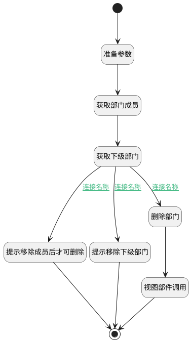

## 删除部门 <!-- {docsify-ignore-all} -->

   

### 处理过程




### 处理步骤说明

#### 开始 :id=Begin<sup class="footnote-symbol"> <font color=gray size=1>[开始]</font></sup>


#### 准备参数 :id=PREPAREJSPARAM1<sup class="footnote-symbol"> <font color=gray size=1>[准备参数]</font></sup>


1. 将`Default(传入变量).id` 设置给  `filter(过滤器).N_DEPARTMENT_ID_EQ`
2. 将`Default(传入变量).id` 设置给  `dept_filter(部门过滤器).N_PARENT_ID_EQ`

#### 获取部门成员 :id=USER<sup class="footnote-symbol"> <font color=gray size=1>[实体数据集]</font></sup>


#### 获取下级部门 :id=DEPARTMENT<sup class="footnote-symbol"> <font color=gray size=1>[实体数据集]</font></sup>


#### 删除部门 :id=DEUIACTION1<sup class="footnote-symbol"> <font color=gray size=1>[实体界面行为调用]</font></sup>


调用实体 [部门(DEPARTMENT)](module/Base/department.md) 界面行为 [删除部门](module/Base/department#界面行为) ，行为参数为`Default(传入变量)`

#### 提示移除成员后才可删除 :id=RAWJSCODE1<sup class="footnote-symbol"> <font color=gray size=1>[直接前台代码]</font></sup>


<p class="panel-title"><b>执行代码</b></p>

```javascript
const bol = await util.confirm.warning({
  title: '提示',
  desc: '请移除该部门下成员才可删除！',
});
```

#### 提示移除下级部门 :id=RAWJSCODE2<sup class="footnote-symbol"> <font color=gray size=1>[直接前台代码]</font></sup>


<p class="panel-title"><b>执行代码</b></p>

```javascript
const bol = await util.confirm.warning({
  title: '提示',
  desc: '请先移除下级部门后才可删除！',
});
```

#### 视图部件调用 :id=VIEWCTRLINVOKE1<sup class="footnote-symbol"> <font color=gray size=1>[视图部件调用]</font></sup>


调用`treeexpbar_tree(树部件)`的方法`refresh`，参数为`treeexpbar_tree(树部件)`
#### 结束 :id=END1<sup class="footnote-symbol"> <font color=gray size=1>[结束]</font></sup>


### 连接条件说明
#### 连接名称 :id=DEPARTMENT-DEUIACTION1

```user_page(用户查询结果).length``` EQ ```0``` AND ```dept_page(部门查询分页结果).length``` EQ ```0```
#### 连接名称 :id=DEPARTMENT-RAWJSCODE1

```user_page(用户查询结果).length``` GT ```0``` AND ```dept_page(部门查询分页结果).length``` EQ ```0```
#### 连接名称 :id=DEPARTMENT-RAWJSCODE2

```dept_page(部门查询分页结果).length``` GT ```0```


### 实体逻辑参数

|    中文名   |    代码名    |  数据类型      |备注 |
| --------| --------| --------  | --------   |
|用户查询结果|user_page|分页查询||
|过滤器|filter|过滤器||
|树部件|treeexpbar_tree|部件对象||
|部门过滤器|dept_filter|过滤器||
|传入变量(<i class="fa fa-check"/></i>)|Default|数据对象||
|部门查询分页结果|dept_page|分页查询||
