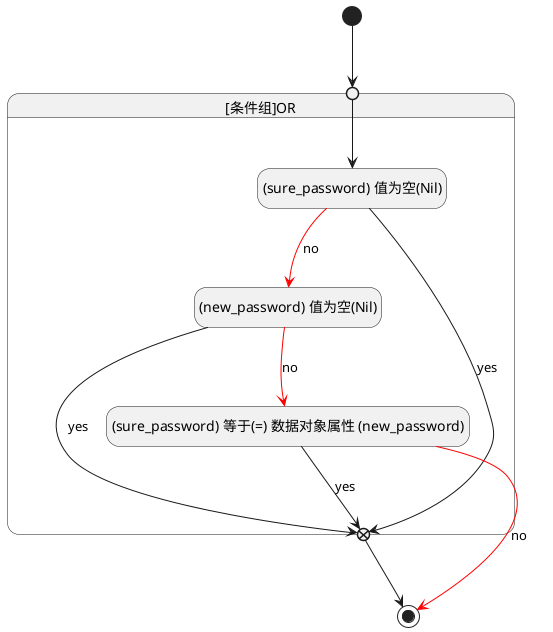

## 密码(PASSWORD) <!-- {docsify-ignore-all} -->

   

### 两次密码不一致 :id=PASSWORD

#### 条件说明

##### (sure_password) 等于(=) 数据对象属性 (new_password) :id=a059005480467d0da7f989f82d923615d

`sure_password` EQ  `new_password`

> [!ATTENTION|label:规则信息|icon:fa fa-warning]
> 两次输入的密码不一致

##### (sure_password) 值为空(Nil) :id=ac1708b06d3cabcf75bf5ea0811264cf0

`sure_password` ISNULL 

##### (new_password) 值为空(Nil) :id=abbcdb2e690e42c4465a7a482c6044676

`new_password` ISNULL 

### 默认规则 :id=Default

```plantuml
@startuml
hide empty description
<style>
root {
  HyperlinkColor #42b983
}
</style>

state "start" as start  <<start>>
state "end" as end <<end>>
state "默认字符串长度" as 04235b1dd6afdfc797cf28f8d9b31627 [[$./password#a04235b1dd6afdfc797cf28f8d9b31627 {"默认字符串长度"}]]


start --> 04235b1dd6afdfc797cf28f8d9b31627 
04235b1dd6afdfc797cf28f8d9b31627 --> end 


@enduml
```

#### 条件说明

##### 默认字符串长度 :id=a9b9ca9043ef32cbc6fff3f55136d3fe4

*关键条件*

`PASSWORD(密码)` 属性长度在区间 `(0 , 200]` 内

> [!ATTENTION|label:规则信息|icon:fa fa-warning]
> 内容长度必须小于等于[200]

