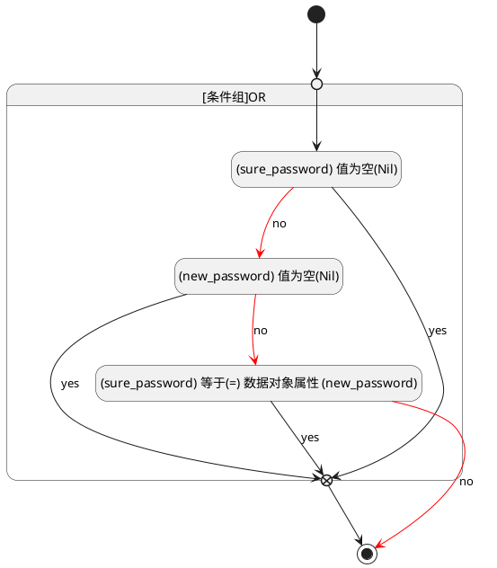

## 密码(PASSWORD) <!-- {docsify-ignore-all} -->

   

### 两次密码不一致 :id=PASSWORD

```plantuml
@startuml
hide empty description
<style>
root {
  HyperlinkColor #42b983
}
</style>

state "start" as start  <<start>>
state "end" as end <<end>>
state "[条件组]OR" as 7d60709c7c349c16723815f0fbb2b710 [[$./password#a7d60709c7c349c16723815f0fbb2b710 {"[条件组]OR"}]] {
state " " as 7d60709c7c349c16723815f0fbb2b710_entry  <<entryPoint>>
state "(sure_password) 值为空(Nil)" as 753f586894c4c6d53d71d443bf90cade [[$./password#a753f586894c4c6d53d71d443bf90cade {"[常规条件] 值为空(Nil)"}]]
state "(new_password) 值为空(Nil)" as 59c3a22a6c63770109ee70abfeddd9d1 [[$./password#a59c3a22a6c63770109ee70abfeddd9d1 {"[常规条件] 值为空(Nil)"}]]
state "(sure_password) 等于(=) 数据对象属性 (new_password)" as ac07c6131c6f2953a7710f6aa0a714a2 [[$./password#aac07c6131c6f2953a7710f6aa0a714a2 {"[常规条件] 等于(=) 数据对象属性 (new_password)"}]]
state " " as 7d60709c7c349c16723815f0fbb2b710_exit  <<exitPoint>>
}


start --> 7d60709c7c349c16723815f0fbb2b710_entry 
7d60709c7c349c16723815f0fbb2b710_entry --> 753f586894c4c6d53d71d443bf90cade 
753f586894c4c6d53d71d443bf90cade --> 7d60709c7c349c16723815f0fbb2b710_exit  : yes
753f586894c4c6d53d71d443bf90cade -[#red]-> 59c3a22a6c63770109ee70abfeddd9d1  : no

59c3a22a6c63770109ee70abfeddd9d1 --> 7d60709c7c349c16723815f0fbb2b710_exit  : yes
59c3a22a6c63770109ee70abfeddd9d1 -[#red]-> ac07c6131c6f2953a7710f6aa0a714a2  : no

ac07c6131c6f2953a7710f6aa0a714a2 --> 7d60709c7c349c16723815f0fbb2b710_exit  : yes
ac07c6131c6f2953a7710f6aa0a714a2 -[#red]-> end  : no
7d60709c7c349c16723815f0fbb2b710_exit --> end 


@enduml
```

#### 条件说明

##### (sure_password) 值为空(Nil) :id=a753f586894c4c6d53d71d443bf90cade

`sure_password` ISNULL 

##### (new_password) 值为空(Nil) :id=a59c3a22a6c63770109ee70abfeddd9d1

`new_password` ISNULL 

##### (sure_password) 等于(=) 数据对象属性 (new_password) :id=aac07c6131c6f2953a7710f6aa0a714a2

`sure_password` EQ  `new_password`

> [!ATTENTION|label:规则信息|icon:fa fa-warning]
> 两次输入的密码不一致

### 默认规则 :id=Default

```plantuml
@startuml
hide empty description
<style>
root {
  HyperlinkColor #42b983
}
</style>

state "start" as start  <<start>>
state "end" as end <<end>>
state "默认字符串长度" as d32746e467e5b7dae82c2782628d0712 [[$./password#ad32746e467e5b7dae82c2782628d0712 {"默认字符串长度"}]]


start --> d32746e467e5b7dae82c2782628d0712 
d32746e467e5b7dae82c2782628d0712 --> end 


@enduml
```

#### 条件说明

##### 默认字符串长度 :id=ad32746e467e5b7dae82c2782628d0712

*关键条件*

`PASSWORD(密码)` 属性长度在区间 `(0 , 200]` 内

> [!ATTENTION|label:规则信息|icon:fa fa-warning]
> 内容长度必须小于等于[200]

