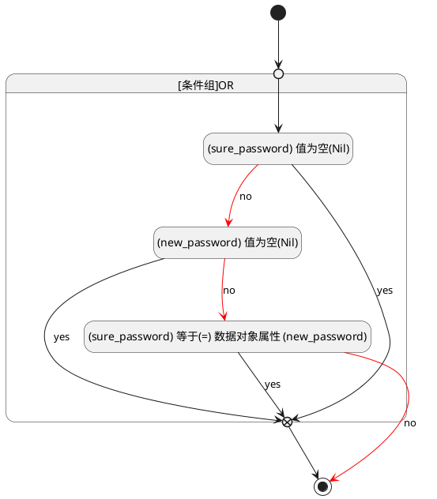

## 密码(PASSWORD) <!-- {docsify-ignore-all} -->

   

### 两次密码不一致 :id=PASSWORD

```plantuml
@startuml
hide empty description
<style>
root {
  HyperlinkColor #42b983
}
</style>

state "start" as start  <<start>>
state "end" as end <<end>>
state "[条件组]OR" as fc8662da3a313f862b7ba52d46355f08 [[$./password#afc8662da3a313f862b7ba52d46355f08 {"[条件组]OR"}]] {
state " " as fc8662da3a313f862b7ba52d46355f08_entry  <<entryPoint>>
state "(sure_password) 值为空(Nil)" as e5c8e930a01a00e0ad1223831dc39b71 [[$./password#ae5c8e930a01a00e0ad1223831dc39b71 {"[常规条件] 值为空(Nil)"}]]
state "(new_password) 值为空(Nil)" as b2a0fa50bba94a0434a8a2debb1d1ab4 [[$./password#ab2a0fa50bba94a0434a8a2debb1d1ab4 {"[常规条件] 值为空(Nil)"}]]
state "(sure_password) 等于(=) 数据对象属性 (new_password)" as 1376ebc6cd86acee7804e91a05b2c4fd [[$./password#a1376ebc6cd86acee7804e91a05b2c4fd {"[常规条件] 等于(=) 数据对象属性 (new_password)"}]]
state " " as fc8662da3a313f862b7ba52d46355f08_exit  <<exitPoint>>
}


start --> fc8662da3a313f862b7ba52d46355f08_entry 
fc8662da3a313f862b7ba52d46355f08_entry --> e5c8e930a01a00e0ad1223831dc39b71 
e5c8e930a01a00e0ad1223831dc39b71 --> fc8662da3a313f862b7ba52d46355f08_exit  : yes
e5c8e930a01a00e0ad1223831dc39b71 -[#red]-> b2a0fa50bba94a0434a8a2debb1d1ab4  : no

b2a0fa50bba94a0434a8a2debb1d1ab4 --> fc8662da3a313f862b7ba52d46355f08_exit  : yes
b2a0fa50bba94a0434a8a2debb1d1ab4 -[#red]-> 1376ebc6cd86acee7804e91a05b2c4fd  : no

1376ebc6cd86acee7804e91a05b2c4fd --> fc8662da3a313f862b7ba52d46355f08_exit  : yes
1376ebc6cd86acee7804e91a05b2c4fd -[#red]-> end  : no
fc8662da3a313f862b7ba52d46355f08_exit --> end 


@enduml
```

#### 条件说明

##### (new_password) 值为空(Nil) :id=ab2a0fa50bba94a0434a8a2debb1d1ab4

`new_password` ISNULL 

##### (sure_password) 等于(=) 数据对象属性 (new_password) :id=a1376ebc6cd86acee7804e91a05b2c4fd

`sure_password` EQ  `new_password`

> [!ATTENTION|label:规则信息|icon:fa fa-warning]
> 两次输入的密码不一致

##### (sure_password) 值为空(Nil) :id=ae5c8e930a01a00e0ad1223831dc39b71

`sure_password` ISNULL 

### 默认规则 :id=Default

```plantuml
@startuml
hide empty description
<style>
root {
  HyperlinkColor #42b983
}
</style>

state "start" as start  <<start>>
state "end" as end <<end>>
state "默认字符串长度" as 6faed9fd2b276be9fcb9e6d6aa669b83 [[$./password#a6faed9fd2b276be9fcb9e6d6aa669b83 {"默认字符串长度"}]]


start --> 6faed9fd2b276be9fcb9e6d6aa669b83 
6faed9fd2b276be9fcb9e6d6aa669b83 --> end 


@enduml
```

#### 条件说明

##### 默认字符串长度 :id=a6faed9fd2b276be9fcb9e6d6aa669b83

*关键条件*

`PASSWORD(密码)` 属性长度在区间 `(0 , 200]` 内

> [!ATTENTION|label:规则信息|icon:fa fa-warning]
> 内容长度必须小于等于[200]

