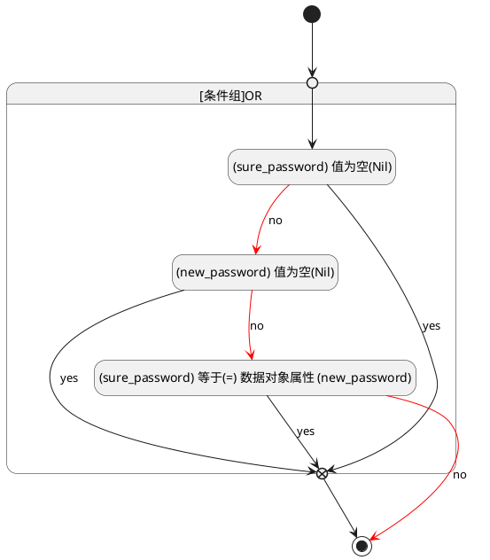

## 密码(PASSWORD) <!-- {docsify-ignore-all} -->

   

### 两次密码不一致 :id=PASSWORD

```plantuml
@startuml
hide empty description
<style>
root {
  HyperlinkColor #42b983
}
</style>

state "start" as start  <<start>>
state "end" as end <<end>>
state "[条件组]OR" as 7019440a58614e1e77d209cce85d6dea [[$./password#a7019440a58614e1e77d209cce85d6dea {"[条件组]OR"}]] {
state " " as 7019440a58614e1e77d209cce85d6dea_entry  <<entryPoint>>
state "(sure_password) 值为空(Nil)" as 7f672107364d6a5349e7be9b4f0052ee [[$./password#a7f672107364d6a5349e7be9b4f0052ee {"[常规条件] 值为空(Nil)"}]]
state "(new_password) 值为空(Nil)" as aace34542e40c0d01abf4a0d38c4a604 [[$./password#aaace34542e40c0d01abf4a0d38c4a604 {"[常规条件] 值为空(Nil)"}]]
state "(sure_password) 等于(=) 数据对象属性 (new_password)" as e860ef4f6d5c02b66d6b0f54c7a5e21c [[$./password#ae860ef4f6d5c02b66d6b0f54c7a5e21c {"[常规条件] 等于(=) 数据对象属性 (new_password)"}]]
state " " as 7019440a58614e1e77d209cce85d6dea_exit  <<exitPoint>>
}


start --> 7019440a58614e1e77d209cce85d6dea_entry 
7019440a58614e1e77d209cce85d6dea_entry --> 7f672107364d6a5349e7be9b4f0052ee 
7f672107364d6a5349e7be9b4f0052ee --> 7019440a58614e1e77d209cce85d6dea_exit  : yes
7f672107364d6a5349e7be9b4f0052ee -[#red]-> aace34542e40c0d01abf4a0d38c4a604  : no

aace34542e40c0d01abf4a0d38c4a604 --> 7019440a58614e1e77d209cce85d6dea_exit  : yes
aace34542e40c0d01abf4a0d38c4a604 -[#red]-> e860ef4f6d5c02b66d6b0f54c7a5e21c  : no

e860ef4f6d5c02b66d6b0f54c7a5e21c --> 7019440a58614e1e77d209cce85d6dea_exit  : yes
e860ef4f6d5c02b66d6b0f54c7a5e21c -[#red]-> end  : no
7019440a58614e1e77d209cce85d6dea_exit --> end 


@enduml
```

#### 条件说明

##### (sure_password) 等于(=) 数据对象属性 (new_password) :id=ae860ef4f6d5c02b66d6b0f54c7a5e21c

`sure_password` EQ  `new_password`

> [!ATTENTION|label:规则信息|icon:fa fa-warning]
> 两次输入的密码不一致

##### (sure_password) 值为空(Nil) :id=a7f672107364d6a5349e7be9b4f0052ee

`sure_password` ISNULL 

##### (new_password) 值为空(Nil) :id=aaace34542e40c0d01abf4a0d38c4a604

`new_password` ISNULL 

### 默认规则 :id=Default

```plantuml
@startuml
hide empty description
<style>
root {
  HyperlinkColor #42b983
}
</style>

state "start" as start  <<start>>
state "end" as end <<end>>
state "默认字符串长度" as 47e6253fb60637aed99633d975cf9a2b [[$./password#a47e6253fb60637aed99633d975cf9a2b {"默认字符串长度"}]]


start --> 47e6253fb60637aed99633d975cf9a2b 
47e6253fb60637aed99633d975cf9a2b --> end 


@enduml
```

#### 条件说明

##### 默认字符串长度 :id=a47e6253fb60637aed99633d975cf9a2b

*关键条件*

`PASSWORD(密码)` 属性长度在区间 `(0 , 200]` 内

> [!ATTENTION|label:规则信息|icon:fa fa-warning]
> 内容长度必须小于等于[200]

