## 新建版本时填充默认版本名称 <!-- {docsify-ignore-all} -->

   新建版本时，根据已创建的版本记录生成默认版本名称

### 处理过程

```plantuml
@startuml
hide empty description
<style>
root {
  HyperlinkColor #42b983
}
</style>

hide empty description
state "开始" as Begin <<start>> [[$./fill_default_name#begin {"开始"}]]
state "获取当前版本" as RAWSQLCALL1  [[$./fill_default_name#rawsqlcall1 {"获取当前版本"}]]
state "填充默认版本名称" as RAWSFCODE1  [[$./fill_default_name#rawsfcode1 {"填充默认版本名称"}]]
state "结束" as END1 <<end>> [[$./fill_default_name#end1 {"结束"}]]


Begin --> RAWSQLCALL1
RAWSQLCALL1 --> RAWSFCODE1
RAWSFCODE1 --> END1


@enduml
```




### 处理步骤说明

#### 开始 :id=Begin<sup class="footnote-symbol"> <font color=gray size=1>[开始]</font></sup>


*- N/A*
#### 获取当前版本 :id=RAWSQLCALL1<sup class="footnote-symbol"> <font color=gray size=1>[直接SQL调用]</font></sup>


<p class="panel-title"><b>执行sql语句</b></p>

```sql
select IDENTIFIER, `NAME` from `version`
where owner_id = ? and owner_type = ?
order by IDENTIFIER desc
limit 1

```

<p class="panel-title"><b>执行sql参数</b></p>

1. `Default(传入变量).OWNER_ID(所属数据标识)`
2. `Default(传入变量).OWNER_TYPE(所属数据对象)`

重置参数`cur_version(当前版本)`，并将执行sql结果赋值给参数`cur_version(当前版本)`

#### 填充默认版本名称 :id=RAWSFCODE1<sup class="footnote-symbol"> <font color=gray size=1>[直接后台代码]</font></sup>


<p class="panel-title"><b>执行代码[Groovy]</b></p>

```groovy
def default_obj = logic.param('default').getReal()
def cur_version = logic.param('cur_version').getReal()
def cur_version_identifier = cur_version.get('identifier') // 当前版本编号
if(cur_version_identifier){
    def new_version_name = 'v' + (cur_version_identifier + 1)
    default_obj.set('name', new_version_name) // 新版本名称
    default_obj.set('cur_version_name', cur_version.get('name')) // 当前版本名称
} else {
    default_obj.set('name', 'v2') // 新版本名称
    default_obj.set('cur_version_name', 'v1') // 当前版本名称
}


```

#### 结束 :id=END1<sup class="footnote-symbol"> <font color=gray size=1>[结束]</font></sup>


返回 `Default(传入变量)`


### 实体逻辑参数

|    中文名   |    代码名    |  数据类型    |  实体   |备注 |
| --------| --------| -------- | -------- | --------   |
|传入变量(<i class="fa fa-check"/></i>)|Default|数据对象|[版本(VERSION)](module/Base/version.md)||
|当前版本|cur_version|数据对象|[版本(VERSION)](module/Base/version.md)||
