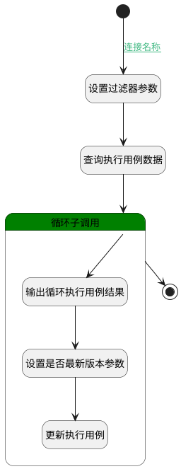

## 判断执行用例是否为最新版本 <!-- {docsify-ignore-all} -->

   当新建版本后，判断测试用例对应的执行用例是否为最新版本，变更newest属性

### 处理过程

### 处理步骤说明

#### 开始 :id=Begin [开始]

*- N/A*
#### 结束 :id=END1 [结束]

*- N/A*

#### 设置过滤器参数 :id=PREPAREPARAM1 [准备参数]

1. 将`Default(传入变量).owner_id(所属数据标识)` 设置给  `filter(过滤器).N_CASE_ID_EQ`

#### 查询执行用例数据 :id=DEDATASET1 [实体数据集]

调用实体 [执行用例(RUN)](module/TestMgmt/run.md) 数据集合 [当前模块下用例(normal)](module/TestMgmt/run#数据集合) ，查询参数为`filter(过滤器)`

将执行结果返回给参数`run_page(执行用例分页结果)`

#### 循环子调用 :id=LOOPSUBCALL1 [循环子调用]

循环参数`run_page(执行用例分页结果)`，子循环参数使用`for_run(执行用例循环变量)`
#### 输出循环执行用例结果 :id=DEBUGPARAM2 [调试逻辑参数]

> [!NOTE|label:调试信息|icon:fa fa-bug]
> 调试输出参数`for_run(执行用例循环变量)`的详细信息

#### 设置是否最新版本参数 :id=PREPAREPARAM2 [准备参数]

1. 将`1` 设置给  `for_run(执行用例循环变量).IS_NEWEST(是否最新)`

#### 更新执行用例 :id=DEACTION1 [实体行为]

调用实体 [执行用例(RUN)](module/TestMgmt/run.md) 行为 [Update](module/TestMgmt/run#行为) ，行为参数为`for_run(执行用例循环变量)`

### 连接条件说明
#### 连接名称 :id=Begin-PREPAREPARAM1

`Default(传入变量).OWNER_TYPE(所属数据对象)` EQ `TEST_CASE`

### 实体逻辑参数

|    中文名   |    代码名    |  数据类型    |  实体   |备注 |
| --------| --------| -------- | -------- | --------   |
|传入变量(<i class="fa fa-check"/></i>)|Default|数据对象|[版本(VERSION)](module/Base/version.md)||
|过滤器|filter|过滤器|||
|执行用例循环变量|for_run|数据对象|[执行用例(RUN)](module/TestMgmt/run.md)||
|执行用例分页结果|run_page|分页查询|||
